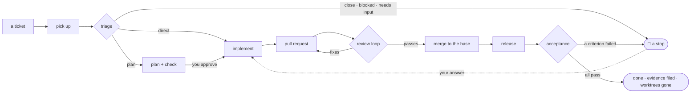

# Ticket pipeline — from a ticket to accepted work, with the record to prove it

Skills for coding agents that take a ticket through pickup, triage, planning,
implementation, pull request, review and merge, release and acceptance — every skill in
its own agent, every fact on disk, the project's specifics read from the project rather
than written into the skills. Install it into any project's `.claude/` directory and
pick, in one interview, which of its twenty-one skills the project uses.
**[`flowcharts.md`](flowcharts.md)** draws every path this takes — the stages and their
decisions, stops and how they are answered, a day, a gate, the install — each branch
mapped to the file that decides it.

## The problem it solves

Working a ticket end to end in one conversation fails in predictable ways:

- **Context rot.** The chat fills with diffs, install logs and gate output until the
  model's judgment degrades — and the record of what was decided lives only in that
  chat. Here every skill runs in a fresh agent that holds nothing but its arguments
  and the few rules it needs, reads rules by reference and command output by excerpt,
  and leaves its facts on disk in the ticket's work directory.
- **One mind checking itself.** The same context plans, implements and reviews, so a
  plausible-but-wrong change sails through. Here the checker never inherits the
  planner's reasoning, the implementer never the planner's, the reviewer never the
  author's — the review agent knows the PR and its ticket link, nothing else.
- **"Done" as a claim.** Nobody proves the acceptance criteria against the environment
  the change reached. Here a gate, a test, a request or a criterion walked against the
  released environment is what "delivered" means, and the evidence is filed.
- **Nothing to resume from.** A question, a failed gate or a closed laptop loses the
  work; a second ticket collides on the same checkout; nobody can see where each
  ticket stands. Here every stop is a logged question with its resume command, every
  ticket has its own worktree and lock, and a status board, an inbox and a virtual
  office show the state without re-reading logs.
- **Process baked into prompts.** Branch names, tracker fields and deploy pipelines end
  up in the instructions, so the process cannot move to the next project. Here the
  project's specifics come from its conventions file and the person's standing
  instructions; the skills carry none.
- **Cost nobody sees.** Agents re-read the same rules, re-run the same gates and
  re-create the same checkouts, and every agent costs a fixed overhead before it reads
  a thing, so what a run really costs is how many of them it started. Here
  gates run once per commit against a cached baseline, one worktree serves the whole
  run, rules are read by reference and command output by excerpt, a stage takes one
  agent for the whole ticket rather than one per repo, a list is filtered by command
  before an agent reads any of it, independent commands go in one call, tokens are
  recorded per stage and priced, and the day's plan runs independent tickets in
  parallel within the usage budget (§ Context management, rules 9 to 12).

## The skills

Twenty-one skills, in five groups. `/tp-setup` asks which groups and skills a project
wants; a skill that is off is not installed (its folder waits under `skills/_off/`),
and everything that depends on it adapts — a run ends at the last active stage, a
merge without `/tp-review` stops for a person's review, a review without
`/tp-create-ticket` lists a pre-existing defect as *ticket needed*.

**Every name carries the `tp-` prefix**, and that is the point: the words these skills
would otherwise want — `status`, `plan`, `review`, `merge`, `doctor`, `setup`,
`schedule` — are words a runtime command, a plugin or a person's own skill already
uses, and a collision does not announce itself: the wrong skill simply runs. The folder,
the `name:` in its frontmatter and the slash command are one string
(`skills/tp-verify/SKILL.md` is invoked as `/tp-verify`), so a new skill added to this
pipeline takes the prefix too, and every reference to it — in a skill, in the runner, in
a script that prints a command for a person to type — uses the full name. Stage names on
disk do **not**: a stage is a row in the ticket's record (`implement`, `merge`), not
something anyone invokes, and records already written keep their meaning. `PREFIX` in
`skills/_lib/setup.mjs` is the one declaration; `tests/skills.test.mjs` fails on any
invocation that loses it.

| Skill | Group | What it does |
|---|---|---|
| `/tp-setup` | — | The integration interview: which skills to activate, the models for the three tiers, the project's gates in its git hooks, the allowlist, the preflight. Always installed. |
| `/tp-run-ticket <ids…>` | ticket pipeline | Runs tickets end to end — one orchestrator agent per ticket, each stage in its own agent — with a run lock, one notification per stop and state on disk so any run resumes; `next count=<n>` picks independent tickets itself. |
| `/tp-start-ticket <id>` | ticket pipeline | Picks a ticket up: blocked check, assign, in progress, rating and estimate, one worktree and branch per repo, the ticket's work directory. |
| `/tp-triage <id>` | ticket pipeline | Decides from the code whether the ticket is implemented directly, planned first, needs input, is closed or is blocked — with the evidence. |
| `/tp-plan <id>` | ticket pipeline | Writes a self-contained plan, has a fresh checker verify it in a bounded loop, and presents it for the person's approval. |
| `/tp-implement <id>` | ticket pipeline | Implements the approved plan in a fresh agent: a commit per step, checkpoints, gates at the end, deviations reported, the PR description drafted. |
| `/tp-create-pr <id>` | ticket pipeline | Commits, syncs, gates and validates the branch, pushes, opens or updates the PR and comments on it and the ticket. |
| `/tp-verify` | ticket pipeline | Runs the project's own gates — the ones its git hooks don't already enforce — as background processes against a cached baseline; a result is recorded per commit and reused. |
| `/tp-review <PR>` | review and merge | Reviews a PR in an isolated agent given only the PR and a neutral scope; incremental passes; posts the review with a machine-readable trailer. |
| `/tp-merge <id>` | review and merge | Runs the review loop to convergence with fix rounds, then merges into the base branch when the review passes and the person's instruction allows. |
| `/tp-release <id>` | after the merge | Watches what the merge triggered, runs the documented operator follow-ups, smoke-checks where it runs, promotes only when asked. |
| `/tp-accept <id>` | after the merge | Walks every acceptance criterion against the released environment or the merged revision, with evidence; the run's last stage. |
| `/tp-retro <id>` | after the merge | Compares the plan with what happened and proposes edits to the conventions file, the ticket template or the instructions. Proposals only. |
| `/tp-plan-day` | the day | Selects the day's tickets (sprint or seeded pool draw), checks blockers and dependencies, proposes the plan for review, then runs every independent ticket in parallel. |
| `/tp-inbox` | the day | Every open stop in one pass — its kind, age, the document to read and the resume command; re-invokes what resumes by itself, re-checks blockers, hands the rest over as one interview. |
| `/tp-eod` | the day | The day's close: what finished and what waits, estimates against minutes and actual hours, tokens and cost, carry-over, estimate drift. |
| `/tp-schedule` | the day | The unattended weekday loop through the runtime's scheduler: a probe, then morning, advance and end-of-day tasks. |
| `/tp-status` | tooling | Where every ticket stands — stage, waits, lock, PR and verdict, time, tokens and cost, worktrees, problems — computed by the state script. |
| `/tp-doctor` | tooling | The preflight: node, git, remotes, the hosting CLI, the tracker, the config files, the allowlist, the work directory — each failing check with its fix. |
| `/tp-notify` | tooling | One line per stop or finished run to the project's chat channel; silent without a chat tool. |
| `/tp-create-ticket` | tooling | Turns a request, a bug report or a review's pre-existing defects into well-formed tracker tickets. The only skill that creates tickets. |

The groups are the interview's questions: the *ticket pipeline* is the core every
other group builds on (`/tp-run-ticket` needs its six stage skills; `/tp-implement`,
`/tp-create-pr` and `/tp-review` need `/tp-verify`); *review and merge* comes off when people
review and merge by hand; *after the merge* when nothing deploys or a person checks;
*the day* is the loop around the pipeline (`/tp-schedule` needs the other three and is
off unless asked for); *tooling* stands alone. A dependency left out is added by the
script, and the report says for whom.

## How it works



Every diamond is a decision made from evidence, every bell a question that waits for a
person — [`flowcharts.md`](flowcharts.md) draws all of them, including the paths this
summary leaves out (resume, the day, gates, the install). Stage by stage — who runs it,
in what agent, and what it leaves on disk (§ The skills has the one-line version of
each):

| Stage | Skill | Runs in | Writes |
|---|---|---|---|
| 0 | `/tp-create-ticket <text>` | its agent, read-only on the repo for the brief | a ticket in the tracker — no work directory, nothing logged |
| 1 | `/tp-start-ticket <id>` | its agent (the blockers' states read directly from the tracker) | worktree + branch per repo — kept for the whole run (§ Worktrees); `ticket.md/.json`, `progress.md` |
| 2 | `/tp-triage <id> [mode=direct\|plan]` | its agent, read-only on the repo, writing its two files | `triage.md/.json` — direct / plan / needs-input / close / blocked |
| 3 | `/tp-plan <id> [check-only=true]` (when triage says so) | its agent plans and revises; a fresh checker per pass — each read-only on the repo, writing its own file; the checked plan is presented to the person for approval | `plan.md/.json`, `plan-check.json`; the go-ahead in `answers.md` |
| 4 | `/tp-implement <id>` | its agent implements — one per repo, never the planner's | commits; `plan.md` summary; `implement[.repo].json`; the PR description drafted (`pr-body[.repo].md`) |
| 5 | `/tp-create-pr <id> [update=true]` (one run, every repo) | its agent (+ a diff validator on a creation round; a describer only for a branch `/tp-implement` left no draft for; `/tp-verify` only when no result is recorded for the commit) | a described, gated PR; comments, ticket status; `pr[.repo].json`, `report.md` |
| 6 | `/tp-merge <id>` (one run, every repo) | its agent (+ `/tp-review` per pass, a fixer and a `/tp-create-pr` round per fix round) | the review loop, the merge; `pr[.repo].json` reviews and sha — the worktree stays |
| 7 | `/tp-release <id> [promote=]` (one run, every repo) | its agent watches the runs and smoke-checks itself; an operator per tool set of follow-ups | deploy watched, follow-ups, smoke; `release[.repo].json` |
| 8 | `/tp-accept <id>` | its agent walks the criteria — the live environment, or the ticket's worktree at the merge commit; removes the worktrees at `done` | `accept.md/.json` — pass / fail / manual per criterion |
| 8b | `/tp-retro <id>` (optional) | its agent, read-only on the record, writing its two files | `retro.md/.json` — proposals only |
| — | `/tp-verify [path=] [base=] [tests=true] [full=true]` | its agent; the gates the repo's hooks don't own, as background processes, the base from one cached baseline per repo; a result recorded per commit pair and reused | gate table (`HOOK` rows for what the hooks enforce) |
| — | `/tp-review <PR> [mode=full\|delta\|resolution] [tier=] [checkout=]` | its agent, given only the PR, its ticket link and a checkout at the PR's head; the gates from the commit's recorded result, `/tp-verify` only when there is none; a pass's pre-existing defects in one `/tp-create-ticket` call | review comment, verdict, trailer |
| — | `/tp-status [<id> \| problems]` | its agent | a table |
| — | `/tp-notify "<text>" level=` · `/tp-notify setup` | the invoking context — one tool call, no agent | one message to the project's channel, or nothing |
| — | `/tp-run-ticket <ids…>` | one orchestrator agent per ticket, running 1–8 (+8b) | one line per stage; `report.md`; `lock.json` |
| — | `/tp-plan-day [<features…>] [count=] [dry=true] [approve=true]` | its agent (+ parallel lookups); the session interviews the person on the proposal, then starts the runs | the day's tickets, ordered by dependency, proposed for review, then fed to `/tp-run-ticket` in parallel; `_day/<date>.json/.md`, the approval stop |
| — | `/tp-inbox [<id>] [dry=true]` | its agent (the blockers' states read directly); the session interviews and re-invokes | every open stop with its kind and resume command; queued answers, usage pauses past reset and unblocked tickets re-invoked; the rest one interview |
| — | `/tp-eod [date=]` | its agent; the session asks the actual hours once | `_day/<date>.eod.json/.md` — the day's close; `ticket.json.actual` per finished ticket; one line to the channel |
| — | `/tp-doctor [repos=] [tests=true]` | its agent (one tracker read) | `_doctor.json` — the preflight: toolchain, remotes, the platform CLI, the tracker, the files, the allowlist, the work directory — each with its fix |
| — | `/tp-schedule on\|off\|status` | its agent | the runtime's scheduled tasks: a probe, then the morning, advance and end-of-day tasks; `_schedule/tasks.json`, `probe.json` |
| — | `/tp-setup [all=true \| skills=a,b \| models=… \| status]` | the invoking context — it asks the person | `pipeline.json` (which skills are on), `tiers.json` (the models), the folders of skills that are off moved to `skills/_off/`; the allowlist lines printed |

Five ideas carry all of it:

- **Every skill runs in a dedicated agent** (§ Definitions). Whoever invokes it — a
  person, `/tp-run-ticket`, another skill — holds nothing but the report. A question for
  the person comes back as a stop, never as a dialogue inside an agent.
- **The work directory is the state** (§ Work directory): `.md` for people, `.json`
  contracts for the next stage, an append-only `progress.md`, and a dependency-free
  script that computes where a ticket stands and what runs next. Nothing is decided by
  re-reading a chat, so any run resumes and several run side by side.
- **Independence where it matters**: the checker never inherits the planner's
  reasoning, the implementer never the planner's, the reviewer never the author's —
  the review agent knows the PR and the ticket link it carries, never the work
  directory.
- **The model follows the task** (§ Models and budget): each agent is spawned on the
  tier its own task's complexity needs, within the account's usage limits, never on the
  model the session happens to run on.
- **"Delivered" means a check proved it** — a gate, a test, a request, a criterion
  walked against the environment the release reached.

Project-specific facts — base branch, naming, merge strategy, who reviews, what a merge
triggers, follow-ups, environments — come from the repo's **conventions file** and the
person's standing instructions, never from a skill.

## Using it

### Install

1. Copy `skills/`, `workflows/`, `tests/` and (optionally) `office/` into
   `<project>/.claude/` — the folder that holds your repo, or the parent folder of
   several repos worked together (the skills find the git checkouts at or under where
   the session runs). Add `.claude/work/`, `.claude/tiers.json`, `.claude/notify.json`,
   `.claude/office.json`, `.claude/tracker.json` and
   `.claude/office/electron/node_modules/` to `.gitignore` (per machine and per
   project); `.claude/pipeline.json` — which skills the project uses — is the
   project's and is versioned.
2. Run **`/tp-setup`** — the integration interview (`skills/tp-setup/SKILL.md`). It asks,
   one question per group, which skills to activate (§ The skills: the core is
   preselected, `/tp-schedule` is not; a dependency left out is added and named), asks
   once for the three model names the runtime knows and writes `tiers.json` — the
   only place a model name is ever written (§ Models and budget) — offers to put each
   repo's own gate commands in its **pre-commit and pre-push hooks**, which is what
   makes those gates free for the pipeline (§ Verification rules), writes
   `pipeline.json`, moves the folders of skills that are off to `skills/_off/`,
   prints the permission lines the selection needs, runs `/tp-notify setup` when
   notifications are on, and ends with `/tp-doctor`. `/tp-setup all=true` takes everything
   without asking; `/tp-setup` again changes the selection; `/tp-setup status` shows it.
   Have available: `git`; Node 18+ (the scripts); the hosting platform's CLI or tool;
   a connection to your tracker; optionally a chat tool the session can post to.
   The permission lines `/tp-setup` prints — the pipeline's own commands, allowed once so
   no agent waits on a prompt for them — go in the runtime's permission settings
   (`<.claude>/settings.json`, `permissions.allow`; adjust the command syntax to your
   runtime); the full set is:
   ```
   Bash(node <.claude>/skills/_lib/*)   Bash(node <.claude>/office/*)   Bash(node --test *)
   Bash(git status*) Bash(git diff*) Bash(git log*) Bash(git show*) Bash(git fetch*) Bash(git rev-parse*)
   Bash(git merge-base*) Bash(git branch*) Bash(git worktree *) Bash(git checkout *) Bash(git switch *)
   Bash(git add *) Bash(git commit *) Bash(git merge *) Bash(git push *)
   Bash(<hosting CLI> pr *) Bash(<hosting CLI> run *) Bash(<hosting CLI> api *)
   Bash(<the gate commands the conventions file names>)
   ```
   plus the tracker's and chat tool's read tools as the runtime lists them (§ Definitions,
   Tracker — a fixture tracker needs none). Everything
   else stays a prompt (§ Definitions, Tools and permissions). In `tiers.json`, set
   `prices` (§ Models and budget, Cost — without it costs stay empty) and
   `doctor.checks` (§ Using it, Preflight — the hosting CLI's auth check, e.g. `{ "name":
   "hosting CLI", "run": ["<cli>", "auth", "status"] }`); `gates` (§ Verification
   rules: `lockMinutes` 30, `keepBases` 10, `keepResults` 50) needs no setting.
3. Tell it about the project in the **conventions file** (the first of `AGENTS.md`,
   `CONTRIBUTING.md`, `CLAUDE.md` in each repo) and your standing instructions. The
   skills look there for: the base branch PRs target; branch and commit conventions;
   merge strategy and whether a passing review may merge without asking; who reviews;
   the gate commands or package scripts; what a merge triggers (pipeline name, how to
   list its runs, typical duration); operator follow-ups after a merge; environments
   (name, URL, a health/version endpoint); how to make a disposable copy of shared
   data; test accounts or fixtures for acceptance; the priority order of ticket kinds
   when the pipeline picks the next ticket. Anything missing is asked once, recorded in
   the ticket's `answers.md`, and `/tp-retro` later proposes moving recurring answers into
   the conventions file.
4. Check the scripts on your Node: `node --test '<.claude>/tests/*.test.mjs'`. What
   is on and off, and any inconsistency between `pipeline.json` and the folders, is
   `/tp-setup status` (also a `/tp-doctor` check).
5. Optional — the office (§ Observability): `<.claude>/office.json` names the team, the
   projects always drawn and the name pools; `node <.claude>/office/serve.mjs` serves
   it at `http://127.0.0.1:4820/` (`--sim` for a demo loop of every panel — the inbox,
   the day board, the drawer, the gauge); `cd <.claude>/office/electron
   && npm install && npm start` opens the same page as a desktop window, with the
   number of stops waiting on a person as the dock badge.

### Configuration — what you set, and where

Every file below sits in `<project>/.claude/` unless it says otherwise. `/tp-setup`
writes the first two and prints the allowlist; the rest you set once, or never.

| File | Written by | Versioned | What it holds |
|---|---|---|---|
| `pipeline.json` | `/tp-setup` | yes — the project's choice | which of the skills this project uses; an absent file means all of them |
| `tiers.json` | `/tp-setup`, then by hand | no — per machine | `low`/`medium`/`high`: the runtime's three model names, **the only place a model name is written**. Also every tunable, each with a working default: `prices` (§ Models and budget), `budget`, `retries`, `compact`, `review`, `day`, `estimate`, `checks`, `doctor`, `gates`, `hooks`, `codegen` |
| `notify.json` | `/tp-notify setup` | no — per install | the chat tool and the channel one line per stop goes to; without it notifications are a silent no-op |
| `settings.local.json` (or your runtime's settings) | you, from the list `/tp-setup` prints | no | the permission allowlist — the commands the skills may run without asking |
| `office.json` | you, optional | no | the office's team name, the projects always drawn, the name pools (§ Observability) |
| `tracker.json` | you, only for a dry run | no | `{ "kind": "fixture", "path": "<abs>" }` — points the skills at the file-backed tracker instead of a real one (§ Simulation) |
| each repo's **conventions file** (`AGENTS.md`, `CONTRIBUTING.md` or `CLAUDE.md`) | you | yes — it is the repo's | everything project-specific: base branch, branch and commit conventions, merge strategy and who reviews, the gate commands, what a merge triggers, operator follow-ups, environments, test data. The skills carry none of this |
| each repo's `.husky/` hooks | `/tp-setup` | yes — the team's | the gates the repo enforces itself, which the pipeline then does not re-run (§ Verification rules) |

Nothing else is configuration. A skill reads the project's facts from the conventions
file and your standing instructions, and everything a run produces goes in the work
directory (§ Work directory), never into settings.

### One ticket, one command

```
/tp-run-ticket ABC-123
```

runs in an orchestrator agent and returns one line per stage —

```
1/8 start-ticket · feat/inline-search in api
2/8 triage · plan (high)
3/8 plan · 4 steps · risks: access-control · check ok · approved
4/8 implement · api · 4/4 steps · gates PASS
5/8 create-pr · <PR url> · gates PASS
6/8 merge · api · review PASS WITH WARNINGS ×2 · merged 3f2a9c1
7/8 release · api · run succeeded · 1 follow-up · smoke pass
8/8 accept · 5 pass · 0 fail · 1 manual
```

— the plan line is where every planned ticket first stops: the checked plan is put to
you for approval (`go-ahead`) or changes, and the run continues from your answer —
followed by what shipped, the PR, the verdict, the deploy, the acceptance table and
the manual steps left for a person. `/tp-status` shows where it is meanwhile. The
ticket's status is yours to close; `accept.md` is the evidence. A fresh project is
asked once for its notification channel (§ Observability). Options are the skill's
Input (`/tp-run-ticket`): `mode=direct|plan`, `promote=`, `where=`, `env=`, `retro=true`,
`until=`, `round=`, `tier=`, `merge=auto|ask`, `owner=`, `answers=`, plus any stage's
own argument, forwarded to it.

### Stage by stage

Every command in the table above works on its own, from wherever the ticket is: a
stage invoked ahead of the ticket's state brings it there first (§ Definitions, Entry
points) — `/tp-merge ABC-123` on a fresh ticket runs pickup, triage, plan, implement and
the PR before the merge; `/tp-implement ABC-123` on a triaged ticket runs the plan when
triage asked for one, stops for its approval, then runs itself. Each spawns the skill's agent and relays its
report — a stop as an interview. `/tp-create-pr` also works on any branch without a
ticket; `/tp-review` on any PR; `/tp-verify` in any checkout.

### When it stops

A stage stops for something a person must decide or fix — a soft-blocked ticket, an
open question in the plan, **the plan itself** (every checked plan is presented for
approval or changes before anything is implemented), an implementer that cannot choose, an
ambiguous conflict, a review loop that stopped converging, a merge that needs a yes, a
failed deploy, a failed criterion, a usage limit, a lock held by another run. The stop
is logged with the exact question, the lock is released, `/tp-notify` sends one line, and
the report carries it (a lock held elsewhere is only reported — nothing is logged or
unlocked in a ticket another run drives). A failure nobody could auto-resolve is the
same shape with `error:` in front, `needs:` naming what you must fix and
`answers=retry` to go on (§ Failures and escalation). In a session the stop reaches
you as an interview — each question with its choices and the default — and the run
resumes by itself with what you chose. When the question is about a document — a
plan, a day's plan — that document is put in front of you in the conversation first,
so you can read it and quote it back as a change; an interview's options are for
choosing, not for reading (§ Definitions, Asking the user). To answer
later, or from another session:

```
/tp-status ABC-123                                # what it is waiting on
/tp-run-ticket ABC-123 answers="1: … | 2: …"      # or the stage itself: /tp-implement ABC-123 answers="…"
```

Resume is automatic: only what isn't done runs (§ Definitions, Resume).
`/tp-status problems` lists tickets whose state is inconsistent — an error stop naming
the fix; `answers=retry` once it is made. `/tp-inbox` is the same for everything at once:
every open stop across tickets and days with its kind and resume command; what can go
on by itself (an answer queued from the office, a usage pause past its reset, a parked
ticket whose blockers landed) is re-invoked, the rest is put to you in one interview.

### Several tickets, or nobody watching

`/tp-run-ticket A B C` runs each ticket in its own agent, worktree and work directory —
the orchestrators are spawned together, so the tickets run in parallel from the first
minute; `/tp-run-ticket next count=3` picks three that are unblocked and independent of
each other and does the same; `/tp-plan-day` is the full form (blockers, dependencies,
the day's plan, § A day at a time). For a batch nobody will watch, the same chain
exists as a script for the runtime's workflow-script tool (`workflows/tp-run-ticket-unattended.js`,
opt-in — § Unattended runs).

### A day at a time

```
/tp-plan-day                                   # today's sprint tickets — or a draw from the open pool
/tp-plan-day "Roles & Permissions" count=3     # only that feature, at most three tickets
```

picks the day's tickets — the current sprint when the team runs one, otherwise a
random draw from the open pool, seeded by the date — keeps only what nothing outside
the day blocks, orders the rest by what depends on what, **puts the plan to you
first** — `approval needed: day plan <date> — now: A, B · then: C after A — approve
(go-ahead), or adjust: drop <ids> | only <ids> | add <ids> | first <ids> |
lanes=<n|all>`; an adjustment comes back as a new proposal, `go-ahead` starts it
(`approve=true` skips the question; from the office, the answer is typed on the
inbox card) — and **schedules them into your days**: a day is `hours × focus` focused hours (the person's day of § Models
and budget, Estimates — 5.2 h by default), every extra ticket in a day costs the
switch hours, a ticket larger than what is left of a day starts anyway and carries
over, and a ticket already running takes its attention share out of today. Each
ticket's hours are the tracker's estimate or the pipeline's own. Two tickets of 6 h
and 4 h on an 8-hour day therefore read:
`day 1 · A 5.2h` and `day 2 · A 0.8h, B 4h` — that is your attention forecast, not
the pipeline's order: **every ticket that is unblocked and depends on nothing still
open starts now, in parallel**, through one `/tp-run-ticket A B …`; a dependent starts
the moment its prerequisite's code is on the base branch; each time a run returns,
whatever became ready starts. The usage budget is the only cap (`tiers.json.day.lanes`:
none when the window is `ample` or unread, one at a time in `economy`, nothing at
`stop`; `lanes=<n>` overrides). What yesterday's plan left unfinished comes first
today. `hours=4` or
`focus=0.4` describe a short or meeting-heavy day. A ticket parked on a blocker —
skipped by the plan, or parked by triage — is re-checked by every advance and by
`/tp-inbox`, and re-queued or resumed the moment its blockers are resolved. The plan and
its progress are `<.claude>/work/_day/<date>.json` and `.md`; `dry=true` plans
without starting.

### Simulation

`node <.claude>/tests/sim/setup.mjs [<dir>]` builds a throw-away install: the
skills, workflows, tests and office copied into `<dir>/.claude`, two small repos
(`api`, `web`) on `main` with a conventions file and a bare remote each, `tiers.json`
with this machine's models, `tracker.json` pointing at a copy of the fixture tracker
(`tests/fixtures/tracker.json`: a sprint, an epic with children, a blocked ticket, a
bug, a tracker estimate, a finished ticket), a silent `notify.json` and the allowlist.
A session opened there runs the pipeline against no tracker account and no hosting
account: `/tp-doctor`, `/tp-plan-day` (the sprint from the fixture), `/tp-status`, `/tp-inbox`,
`/tp-eod`, and `/tp-run-ticket <id>` through pickup, triage, plan and implement —
`/tp-create-pr` onwards needs a real hosting platform (the bed stops at the push), and
the office serves the bed's own work directory. The fixture is copied, so nothing a
run does reaches `tests/fixtures/`.

### Preflight

`/tp-doctor` asks whether the install can run a ticket right now — Node and git, every
repo's remote reachable with the identity it needs, the hosting platform's CLI logged
in (`tiers.json.doctor.checks`), the tracker answering, `tiers.json`, `notify.json`
and `office.json` valid, the runtime's allowlist complete, the work directory clean
(no stray file at its root, no stale lock, no orphan worktree) — and prints each
failure with its fix. It also reports what the repos' hooks enforce (§ Verification
rules) and whether the active skills match `pipeline.json` (§ Definitions, Active
skills). `/tp-plan-day` and `/tp-run-ticket` run it by themselves before a run: `node
<.claude>/skills/_lib/doctor.mjs fresh <.claude>` — exit 0 fresh and clean, nothing to
do; **exit 1** (no preflight, or older than `doctor.maxAgeHours`, a day) → invoke
`/tp-doctor` and go on from its table; **exit 2** (the last one failed), or a fresh
`/tp-doctor` reporting a failure → its error form is the invocation's report and nothing
runs. So an expired credential or a missing key is an error stop *before* a run, not
inside one; with `/tp-doctor` off for the project (§ Definitions, Active skills) no
preflight runs at all.

### End of day

`/tp-eod` closes the day: what finished, what stands where and on what it waits, each
ticket's estimate against the pipeline's minutes, tokens and cost, what carries over
to tomorrow, and how far the estimates drift — written to
`<.claude>/work/_day/<date>.eod.md`, one line to the channel. It asks you once, in one
interview, the hours you actually spent on each ticket that finished today (the
estimate is the default, `skip` records nothing): those actuals are what teaches the
estimates (§ Models and budget, Estimates).

### After acceptance

All pass → close the ticket yourself; the worktrees are gone (`/tp-accept`'s `done`
removes them — the run's last stage, § Worktrees). A criterion fails →
`/tp-run-ticket ABC-123 round=2` (the same worktree, re-branched from the base, which now
holds the merged work). `/tp-retro ABC-123` proposes changes to the conventions file, the
ticket template or your instructions. `/tp-status` lists anything still checked out by a
stopped or abandoned ticket, with the commands.

## Reference — the conventions every skill follows

The skills point here instead of restating these; [`flowcharts.md`](flowcharts.md) maps
each rule below to the branch it decides, if a picture is the faster way in.

### Definitions

- **Conventions file** — per repo, the first that exists of `AGENTS.md`,
  `CONTRIBUTING.md`, `CLAUDE.md`. None → the repo's git history and the tracker's
  existing tickets are the convention.
- **Tracker** — where the tickets live: the connected tracker tool, found by name
  with the runtime's tool lookup (Runtime notes) — or, when `<.claude>/tracker.json`
  says `{ "kind": "fixture", "path": "<abs>" }`, the file-backed tracker
  `<.claude>/skills/_lib/tracker.mjs` (`get`, `list`, `save`, `comment`, `create`,
  `iterations`, `labels`, `states`, `me`), whose commands are the same reads and
  writes the skills make against a real one (§ Using it, Simulation). Every skill
  that reads or writes a ticket, a relation, a comment, an iteration or a label
  means this definition by "the tracker"; a fixture ticket's link is
  `fixture://<id>`.
- **Active skills** — `<.claude>/pipeline.json` (`/tp-setup`; absent = everything on)
  says which skills this project uses; a skill that is off has no folder under
  `skills/` (it waits in `skills/_off/`). What depends on it adapts, and this is the
  one place it is said: the state script leaves the stage of an off `tp-merge`,
  `tp-release` or `tp-accept` out of a ticket's expected stages, so `next` skips it and a
  run ends at the last active stage (`/tp-run-ticket`'s close-out then removes the
  worktrees); `/tp-merge` without `/tp-review` stops for a person's review (its hand-off,
  case 3); `/tp-review` without `/tp-create-ticket` lists a pre-existing defect as
  *ticket needed*; `/tp-accept` without `/tp-release` walks the merged revision
  (`where=checkout`); `/tp-run-ticket` and `/tp-plan-day` without `/tp-doctor` run no
  preflight; `retro=true` without `/tp-retro` is noted and ignored; `/tp-notify` off sends
  nothing, exactly as without a chat tool; `/tp-schedule` needs `/tp-plan-day`, `/tp-inbox`
  and `/tp-eod`. The core stage skills are never off inside a run that starts.
- **Base branch** — the branch PRs in the repo target (the integration branch, not
  necessarily the remote default). Detected once per repo, recorded in `ticket.json`:
  conventions file → base of recent merged PRs → the remote's default; ask once if two
  candidates remain.
- **`<.claude>`** — the `.claude` directory that contains this `skills/` folder,
  resolved to an absolute path once; every path handed to an agent is absolute.
- **Repo name** — `basename(<repo path>)`, the key everywhere a repo is named:
  `wt/<name>`, `<file>.<name>.json`, `checkpoint.<stage>.<name>.md`, `repo=<name>`, and
  the stage names `implement:<name>` / `create-pr:<name>` / `merge:<name>` /
  `release:<name>` of a
  cross-repo ticket (single-repo tickets use the plain names; the script rejects the
  other form). The stages are `start-ticket`, `triage`, `plan`, `plan-check` (logged
  by `/tp-plan` around its checker), `implement`, `create-pr`, `merge`, `release`, `accept`, plus
  `run-ticket` and `retro` outside the sequence.
- **Runtime notes** — where runtime specifics are named. Skills are invoked with the
  runtime's skill tool (`skill: "<name>", args: "<id> key=value …"`); agents are
  spawned with its agent tool, each with an explicit `model`, as one of the runtime's
  two types: a *writing agent* (edit and shell, restricted to the files its job owns —
  a planner or checker that only reads the repo still writes its own output file, so
  it is one) or a *read-only agent* (read and search; a shell only to run the one
  command it reports on). The pipeline's jobs (§ Context management, rule 9) map onto
  them: assess, look up, run a command and report → read-only; write code, write
  prose, operate an environment → writing. Background mode is for work its spawner
  outlives — a run the session watches; a batch whose results the
  spawner needs before its next step (candidate fetches, a checker, a validator, an
  operator) is spawned in one message and awaited in the foreground,
  because an agent that ends its turn waiting on background children is not reliably
  woken when they finish. The session is the exception: the runtime wakes it for every
  background agent it started, so `/tp-run-ticket`'s orchestrators and `/tp-plan-day`'s runs
  are spawned from the session in the background. A person is reached only through
  the runtime's interactive question tool, and only from the session (Asking the
  user); a tool is found with the runtime's tool lookup; the account's usage windows
  come from its usage reading (percent used and reset time per window); a batch of
  tickets runs through its workflow-script tool. An agent's context is its prompt plus
  the files it is pointed at, nothing else; a skill flagged to fork the conversation is
  not isolation and is never used.
- **Tools and permissions** — every spawn names the tools its agent needs, and the
  agent loads them before its first step: the scripts (`node <.claude>/skills/_lib/…`),
  `git`, the hosting platform's CLI, the tracker's or chat tool's tools by name (found
  with the runtime's tool lookup), the usage reading. A read-only agent gets read and
  search tools (and the one command it runs); a writing agent edit and shell too; an
  agent that operates an environment the deploy and environment tools its follow-up
  names, nothing else. An agent never finds out mid-task that it lacks a tool: a tool
  missing from the environment is an *environment* failure (§ Failures and escalation)
  reported before any work — and `/tp-doctor` (§ Using it, Preflight) is where the
  install-wide ones are caught before a run. The runtime's permission allowlist covers the pipeline's
  own commands so no agent waits on a prompt for them (§ Install, step 2); anything
  outside it is asked for through the runtime's prompt and is a stop when denied —
  never worked around.
- **Dedicated agent** — every skill runs in its own fresh writing agent, whoever
  invokes it. An invocation without `inline=true` spawns that agent — one per ticket
  for `/tp-run-ticket` — with the prompt *Dedicated agent for `/<skill>`. Working
  directory `<absolute path>`. Office id `<id>`, parent `<id|none>`: first `state.mjs
  agent join <.claude>/work '{ "id", "level", "role", "stage", "ticket", "repo",
  "parent", "rating" }'`, last `state.mjs agent leave <.claude>/work <id> <done|stopped|gone>`.
  Invoke the `<skill>` skill with the skill tool, args: `<the same arguments>
  inline=true`. Read `skills/README.md` by reference only — `node
  <.claude>/skills/_lib/ref.mjs <.claude> "<Section>[, <Item>…]"` for what the skill
  names, never the file — and long command output by excerpt, from a file (§ Context
  management, rules 10 and 11), and take commands that do not feed each other in one
  call rather than one turn each (rule 12). Return only its report* — on
  the model `model.mjs pick` gives for the
  rating the skill names in its `inline=true` line, after the budget check — and then
  acts on the report alone, by its first line and its last two: an `error:` form or a
  question → relayed upward unchanged, prefixed with the spawner's own stage or agent
  id (§ Failures and escalation; in the session a question becomes the interview,
  Asking the user); nothing returned, or a transient error → re-spawned once with
  `continue=true`; `continue: <checkpoint path>` → re-spawned with the same arguments
  plus `continue=true`; `complexity: higher` → re-spawned with `tier=<next rating>
  continue=true` (§ Models and budget, Escalation); otherwise the report is relayed as
  it is. `inline=true` is passed only by that spawn, by the unattended runner's stage
  agents, by an entry point's `/tp-run-ticket … until=… inline=true` (Entry points) and
  by an agent that cannot spawn (Depth); a person never passes it. Inside the
  dedicated agent the skill's steps run as written — **the skill's own work is that
  agent's** (the triage, the plan, the implementation, the acceptance walk, the retro,
  the discovery for a ticket: it was spawned fresh for exactly this, so a second agent
  for the same job would only repeat its reading — § Context management, rule 9); its
  sub-agents (a checker, a fixer, a describer, a validator, an operator, a lookup that
  must read descriptions) are rated for their tasks, and the skills it invokes get
  dedicated agents of their own — except `/tp-notify`, whose whole job is one tool call
  (its `setup` one question), and `/tp-setup`, whose whole job is the interview: both run
  in the invoking context, and no agent is spawned to send a line, to ask a question,
  or to do nothing where no chat tool is configured. Its sub-agents
  get every rule they need as text in their prompts and never read this file
  (§ Context management, rule 3). When the runtime reports a finished
  agent's token usage, the spawner logs it: `state.mjs log <workdir> <stage> note
  "<role> tokens=<n> tier=<rating>"` — the rating `pick` chose for it, so the tokens can
  be priced (§ Models and budget, Cost); the session logs the orchestrator's own on
  `run-ticket` the same way. An unattended run's stage leads cannot (the script reads
  nothing back), so their tickets' totals are marked partial (§ Unattended runs).
- **Output contract** — every agent a skill spawns returns at most ~15 lines and ends
  with two lines the spawner acts on: `complexity: as rated | higher — <reason>` and
  `continue: no | <checkpoint path>`. Anything larger goes to the work directory,
  referenced by path. A failure it could not resolve comes back as the error form,
  first line `error:` (§ Failures and escalation); a question for the person as a
  stop, first line the question — never as a guess.
- **Office presence** — every agent has a desk in the office (§ Observability). The
  spawner assigns the child's id and passes its own as `parent`; the child registers
  first and unregisters last (the template above; sub-agents get the two commands in
  their prompts). Ids: `<ticket>:<stage>:<level>[:<n>]` — the stage as `progress.md`
  names it where one agent runs one of them (`implement:api` on a cross-repo ticket);
  a stage whose agent covers every repo takes one desk under the bare stage name
  (`create-pr`, `merge`, `release`) while its per-repo rows stay in the ticket's
  record (§ Context management, rule 9), `n` whenever another agent of the
  run shares the same `<stage>:<level>` (a join with an existing id revives that
  record instead of adding one) — the orchestrator `<ticket>:run-ticket:manager`; a
  skill invoked by a stage gets an id under that stage (`<ticket>:create-pr:qa:verify`
  for the `/tp-verify` a `/tp-create-pr` runs); an agent with no ticket
  `<skill>:<slug>:<level>[:<n>]` (`plan-day:2026-09-19:lead`, `review:PR-12:reviewer`).
  The id is a label the office never parses: the record's own fields carry level,
  role, stage, repo, parent and rating. Levels: the orchestrator `manager`; a skill's dedicated
  agent `lead` (whatever it does itself — plan, implement, walk); a fixer, describer
  or operator `engineer`; a checker, diff validator or lookup (a candidate or blocker
  fetch that reads descriptions) `qa`; `/tp-review`'s agent `reviewer`. `role` is the
  free label (`implementer`, `fixer`, `checker`); `rating` the agent's. A child that
  returns nothing or errors is left `gone` by its spawner. The office derives the rest
  — a stage's stop or done, a departed parent, a ticket gone quiet — so a missed
  `leave` is a ghost for a while, not a lie.
- **Depth** — the session and the agents at the first two levels below it can spawn
  agents; an agent at the third level has no agent tool (measured, not assumed). An
  agent without it invokes the skills it needs with `inline=true` — it is their
  dedicated agent — and runs its own fan-out sequentially or as background processes
  (gates), or does the lookups itself (a discovery). What never collapses: the
  reviewer is never the author and the checker is never the planner — a `/tp-merge`
  agent that cannot spawn `/tp-review` stops with the PR URL, a `/tp-plan` agent that
  cannot spawn its checker stops with the plan, for the person.
- **Asking the user** — an agent cannot talk to the person, so "ask" in any skill
  means: log `stopped "<question>"` on its stage (once a work directory exists) and
  return the question as the report; the answer comes back as `answers=` on the next
  invocation. A question is phrased as a decision — its choices and, when there is
  one, the default (`… A, or B? Default: A`), numbered when there are several, the
  answer token when the stop defines one (Resume); a stop with nothing to decide (a
  blocked or cancelled ticket) says `nothing to answer — <what must happen first>`. A
  question a stage writes to its JSON (triage's `questions`) is a string, or the
  structured form `{ text, choices, default }` — the state script renders it as one
  line (`<text> — a | b? Default: a`, numbered when there are several) for the
  report, `/tp-status` and the office; nothing downstream ever sees an object. The state
  script classifies every stop it reports — `kind`: `question`, `approval`, `error`,
  `usage`, `blocked` or `problem` (an inconsistency the script found) — and names the
  command that continues the ticket (`resume`), the answer's default when the stop
  states one, and whether it can go on by itself (`resumable`: a usage pause past its
  reset, a blocked ticket whose blockers are resolved); the inbox (`state.mjs inbox`,
  `/tp-inbox`, the office) is that list for every ticket. An answer may also be **queued**
  for a stop — typed in the office, or `state.mjs answer <workroot> <id> <stage>
  '<text>'` — into `work/_inbox/`, naming the exact stop it answers; the next
  invocation of the stopped ticket takes it as its `answers=` (Resume), so nothing
  applies a stale answer to a later stop.
  The context that spawned the dedicated agent closes the loop: a session, where a
  person is present, does not print the stop and wait for a typed command — it puts
  the questions to the person with the runtime's interactive question tool (one item
  per question, the choices as its options with the default first and marked as such,
  free text through the tool's own "other" choice, a long list in batches; a
  `nothing to answer` stop is shown, not asked). **It shows what the question is
  about before it asks.** A stop carries `doc` — the file a person must read to
  answer it, relative to the work root (`<id>/plan.md` for a plan's approval or its
  open questions, `_day/<date>.md` for a day's) — and the session prints that file's
  contents in the conversation, as its own message, before putting the question. A
  question tool is a place to choose, not a place to read: its options are a line
  each, they do not scroll, and they are gone once answered — so a plan approved from
  the one-line question is a plan approved unseen, and a change request has no text in
  front of the person to quote back. The question itself stays one line whatever the
  document says (that line is what `/tp-status`, the office and `/tp-notify` carry);
  the document is shown beside it, never folded into it. Then the session re-invokes
  the same skill with the same arguments plus `answers="1: <answer> | 2: <answer> |
  …"` (a blank answer means the default) and relays what comes back. It prints the
  resume command — with the `doc` path beside it — instead only where nobody can be
  interviewed: a run whose starting session is gone (a schedule), a stop the person
  read through `/tp-notify`, a runtime without such a tool. Two waits are not logged but derived by the script from a stage's JSON (the
  list is with the `progress.md` grammar, § Work directory).
- **Common arguments** — every skill accepts `inline=true`, `tier=<low|medium|high>`
  (§ Models and budget: the minimum rating for every agent of this invocation, forwarded
  to every skill and sub-agent it spawns; `strong` is an alias of `high`) and
  `continue=true` (start from the checkpoint; ignored when there is none). Stage skills
  that can stop accept `answers=<text>` and `force=true` (Resume). A value arrives
  quoted from an unattended run (`answers="go-ahead"`); skills strip one layer of quotes
  before comparing.
- **Entry points** — every skill works on its own; nothing has to be run before it.
  A stage skill invoked on a ticket that is not yet at its stage — no work directory,
  or the state's `next` an earlier stage (pending, stopped or stale) — first brings
  the ticket there: inside its dedicated agent it invokes `/tp-run-ticket <id>
  until=<this stage> inline=true` with its own arguments (the orchestrator hands each
  to the stage it belongs to — `mode=` to triage, `repo=`, `update=`, `check-only=`,
  `promote=`, `where=`, `env=`, `merge=`, `answers=` — and `owner=` its own id). The
  orchestrator runs the missing stages *and this one*, each in its own dedicated
  agent; the outer agent runs none of its steps itself and returns the stage lines
  followed by the last stage's report. So `/tp-implement ABC-123` on a fresh ticket picks
  it up, triages, plans when triage asked for one (stopping for the plan's approval)
  and implements; `/tp-merge` on a
  branch without a PR opens one first; `/tp-accept` after a merge releases first. The
  stages run this way lock, stop and notify as a run does; a stop in an earlier stage
  is this invocation's stop, answered with `answers=` on the same skill (the channel
  setup of § Observability applies as to any entry point). A ticket already at or
  past the stage → the skill's own steps as
  written (Resume decides between run, resume and refuse). Skills without a stage take
  what they are given — `/tp-plan-day`, `/tp-create-ticket`, `/tp-create-pr` on a branch,
  `/tp-review`, `/tp-verify`, `/tp-status`, `/tp-notify`; `/tp-retro` needs a record and says so when
  there is none.
- **Resume** — one rule for every stage skill. Before logging `started`, read
  `state.mjs state <workdir>`. The ticket is `closed` (§ Work directory) → refuse
  unless `round=` above `ticket.json.round` or `force=true`. The stage is `done` and
  not stale → refuse (`already done; force=true to re-run` — re-running would stale
  everything after it) unless `force=true`, the invocation carries `round=` above
  `ticket.json.round`, or the skill defines a re-run of its own (`/tp-create-pr
  update=true`, a fix round `/tp-merge` asks for). The stage is `stopped` → with
  `answers=`, append the answer to `answers.md` (dated, with the question), then log
  `started` and resume at the stop — from its checkpoint when there is one, so
  `answers=` never needs `continue=true` beside it (`stopped.step` for an implementer,
  the step named in the checkpoint otherwise); without `answers=`, first `state.mjs
  answer <workroot> <id> --consume` — exit 0 hands back an answer queued for this
  exact stop (Asking the user), which is this invocation's `answers=`, recorded in
  `answers.md` with its source (`from the office`); otherwise return the stop
  again — except a usage pause (`stopped "usage at …"`), re-invoked after the reset by
  whoever invoked the paused skill (§ Work directory, the grammar), a blocked ticket
  (`kind: blocked`) whose blockers are all resolved (`unblocked`), which runs as if
  answered — `/tp-run-ticket` re-runs `/tp-start-ticket <id> force=true` first when a repo
  row says `discarded` — and an error stop
  (`stopped "error: …"`, § Failures and escalation), which resumes from its checkpoint
  with `answers=retry` once the person has done what the stop names. A wait the
  script derives (Asking the user) records the answer as a `note`; when the stage then
  re-runs its agent it logs `started` and `done` as usual (a go-ahead alone re-runs
  nothing). The stage is `in-progress` (an agent died) → log `started` and resume
  from the checkpoint or the last `note "step <n> done"`. `pending` or `done` and
  `answers=` given → append it to `answers.md` and do nothing else. Answer tokens: a
  soft-block, a take-over, a reopen, a designated review, a merge, a fix, a retry use
  the token the stop names — `continue`, `takeover`, `reopen`, `reviewed`, `merge`,
  `fix`, `retry`, `resume`, `go-ahead`, `round`, `leave`, `run`, `skip`, `keep`,
  `drop`, `split`, `pool`, `comment`, `create`, `ours`, `theirs`, `change`, each
  defined in its skill's § Stops — never a bare `yes` that would satisfy several.
- **Review verdicts** — `PASS`, `PASS WITH WARNINGS`, `BLOCK` (from `/tp-review`).
- **The scripts** — `<.claude>/skills/_lib/state.mjs` (`log`, `state`/`check` (`--brief`
  for a spawner's routing: the decision fields alone), `all`,
  `durations`, `usage` and `totals` (tokens and cost), `inbox` (every open stop),
  `answer` (queue or `--consume` an answer for a stop), `blockers` (record a re-check
  in `ticket.json.blockedBy`), `actual` (the person's hours), `lock`/`unlock`, `agent
  join|leave`, `office`: skills log
  through it and resume from it, never by re-reading `progress.md` and reasoning) and
  `<.claude>/skills/_lib/model.mjs`
  (`rate`, `budget`, `pick`, `rounds`, `compact`, `retry`, `estimate`, `tiers` —
  § Models and budget) and
  `<.claude>/skills/_lib/day.mjs` (`plan`, `advance`, `status` (the plan with live
  statuses, never written), `eod`, `show`, `lanes` — `/tp-plan-day`'s selection,
  ordering and lanes, the day's end) and `<.claude>/skills/_lib/gates.mjs` (`base`,
  `release`, `cache get|put`, `normalise`, `new`, `result get|put` — the gate
  baseline and the gate record, § Verification rules) and
  `<.claude>/skills/_lib/ref.mjs` (`"<Section>[, <Item>…]"`, `list` — this README by
  reference, § Context management, rule 10), `<.claude>/skills/_lib/hooks.mjs`
  (`detect`, `cover`, `plan`, `install` — the repo's hooks as gate owners,
  § Verification rules), `<.claude>/skills/_lib/codegen.mjs` (`detect`, `status`,
  `mark` — generated code and whether it is behind its schema, § Toolchain) and
  `<.claude>/skills/_lib/setup.mjs`
  (`list`, `check`, `apply`, `status`, `stages` — the catalogue of skills and their
  dependencies, the one place they are declared; § Definitions, Active skills). Every `model.mjs`, `day.mjs` and
  `gates.mjs` call carries `claudeDir: "<.claude>"` so `tiers.json` applies.

### Work directory — the state every stage shares

`<.claude>/work/<id>/`, `<id>` normalised to the tracker's identifier form by every
entry point. Kept after the run as the record; worktrees go when the run ends
(§ Worktrees). Cross-repo tickets have one work directory with one repo row each;
stacked tickets have one each (`stackedOn`). `<.claude>/work/_scratch/` holds the
checkpoints and summaries of `/tp-review`, `/tp-verify` and `/tp-status`, which never log to a
ticket, the per-repo gate baseline and records (`_scratch/wt/base-<repo>`,
`_scratch/gates/<repo>/` — § Verification rules) and a by-hand review's own checkout
(`_scratch/wt/review-<repo>`); `<.claude>/work/_office/` holds the agents'
presence records (§ Observability); `<.claude>/work/_day/` the day plans (`/tp-plan-day`);
`<.claude>/work/_day/<date>.eod.json` and `.md` are the day's close (`/tp-eod`);
`<.claude>/work/_inbox/` answers queued for stops (§ Definitions, Asking the user);
`_budget.json` and `_doctor.json` at the work root are the last usage reading and the
last preflight (§ Models and budget; § Using it, Preflight); a skill without a work
directory that stops writes `_scratch/<skill>-<slug>.stop.json` beside its checkpoint
(`{ id: "<skill>:<slug>", skill, slug, kind, question, at, resume, needs? }`) so the
inbox lists it; `/tp-status` and the state script's `all` ignore every `_`-prefixed entry.

| File | Written by | Purpose |
|---|---|---|
| `ticket.md` / `ticket.json` | start-ticket; triage refines `estimate` and records `blockedBy`; `state.mjs blockers` re-checks it; `/tp-eod` records `actual` | the ticket, its rating, its estimate, its blockers and their last-checked states, the person's actual hours, its repos |
| `triage.md` / `triage.json` | triage | decision with evidence; approach (direct) or scope notes (plan) |
| `plan.md` / `plan.json` | plan, or implement for direct work | the executable plan; implement appends its Implementation summary section |
| `plan-check.json` | plan (its checker) | `ok` / `revise` with findings |
| `answers.md` | whichever stage asked | the person's answers, dated; the plan's approval is the line `go-ahead: <timestamp> — round <n> — <flags>` — no plan is implemented without it |
| `implement[.repo].json` | implement | steps done/total, commits, gates, deviations, stop, rating experienced |
| `pr[.repo].json` | create-pr; merge adds the passes, verdict and sha | PR url/number, update round, review passes, verdict, merge sha |
| `pr-body[.repo].md`, `pr-comment.md`, `ticket-comment.md` | implement drafts the body; create-pr checks and posts it and writes the comments (its describer only for a branch without a draft) | the latest round's description and comments as posted (the PR keeps every round) |
| `diff-validation.md` | create-pr (its validator on a creation round; the round's delta afterwards) | every changed file as Expected / Supporting / Unexpected, with a line of reasoning, and the sha validated through |
| `release[.repo].json` | release | the deploy run, follow-ups, smoke checks, promotion |
| `accept.md` / `accept.json` | accept | pass / fail / manual per criterion, with evidence |
| `retro.md` / `retro.json` | retro | plan-vs-reality, questions asked, time per stage; proposals by target |
| `progress.md` | every stage, via the state script | append-only log |
| `report.md` | create-pr creates or appends; merge, release, accept, run-ticket append | what shipped, PR, verdict, merge, deploy, acceptance, deviations, follow-ups, manual steps |
| `checkpoint.<stage>[.<repo>].md` | any agent that hands off | done / decisions / remaining / open questions — the next agent starts here |
| `lock.json` | run-ticket via the state script | `{ owner, since, updated }` (§ Concurrency) |
| `wt/<repo-name>/` | start-ticket; accept moves it to the merge commit; a new round re-branches it | the ticket's one worktree per repo, from pickup to the end of the run (§ Worktrees: removed by `/tp-accept`'s `done`, or by `/tp-run-ticket`'s close-out of a closed or parked ticket) |

The `.md` is for people; the `.json` is the contract the next stage and the state
script read. Every filesystem path a record holds — a repo's `path`, its `worktree` — is
**absolute** (§ Definitions, `<.claude>`), never relative to the directory the writing
agent happened to run in: the next stage reads the record from somewhere else.

```
ticket.json      { id, title, link, round: n, stackedOn: null|{ticket, branch, pr}, dependsOn: null|{ticket, branch},
                   acceptanceCriteria: [ "…" ], derived: bool, complexity: "low"|"medium"|"high",
                   estimate: { source: "tracker"|"pipeline", focusedHours, days, points, basis },
                   actual: null|{ focusedHours, source: "person"|"tracker", at, by },          ← /tp-eod, through state.mjs actual
                   blockedBy: [{ id, state, resolved, soft, checkedAt }],                      ← triage when it parks; state.mjs blockers on every re-check
                   repos: [{ name, path, worktree, branch, base, conventions, discarded?: "<why>" }] }   ← path, worktree: absolute
triage.json      { decision: "direct"|"plan"|"needs-input"|"close"|"blocked", confidence, override, flags: [],
                   questions: [ "<text>" | { text, choices: ["…"], default: "…" } ],   ← the script renders each as one line
                   blockedBy: [ "<id>" ],                                              ← blocked: the tickets that must land first
                   complexity: "low"|"medium"|"high", estimate: { … as ticket.json }, why: "<close: what delivers or supersedes it | blocked: what must land first>" }
plan.json        { status: "ready"|"open-questions", flags: [], steps: n, openQuestions: n, complexity: "low"|"medium"|"high" }
plan-check.json  { verdict: "ok"|"revise", round: n, override: null|"<timestamp> — <text>",
                   findings: [{ severity: "blocking"|"advisory", step, text }] }
implement.json   { repo, done, total, commits: [], gates: { <gate>: "PASS"|"FAIL" }, deviations: n, stopped: null|{ step, question },
                   complexity: "low"|"medium"|"high"|"higher" }
pr.json          { repo, url, number, round, reviewRounds: n, reviews: [{ round, sha, verdict, open: [ids], new: [ids] }],
                   verdict: null|"PASS"|"PASS WITH WARNINGS"|"BLOCK", merged: null|sha }
release.json     { repo, sameAs: null|ticket, run: null|{ id, status, revision }, env: null|{ name, url },
                   followUps: [{ name, status, note, authority }], smoke: [{ check, result }], promoted: null|{ branch, sha, run } }
accept.json      { where: "live"|"checkout", targets: [{ repo, env, checkout }],
                   criteria: [{ n, text, result: "pass"|"fail"|"manual", evidence }], passed: n, failed: n, manual: n }
retro.json       { deviations: n, reviewFindingsMissedByCheck: n, questions: n, manualCriteria: n,
                   proposals: [{ target: "conventions"|"ticket-template"|"standing"|"skill", text, evidence }] }
```

`progress.md` grammar (the script enforces it):
```
- <YYYY-MM-DDTHH:MMZ> · <stage> · started|done|stopped|note · <summary> · <links>
```
`started` may have no summary and is logged after the state was read (Resume). `done`
closes a stage and is logged only when its outcome is final — for `create-pr` when the
PR is up and current (again on every update round), for `merge` after the merge, for
`accept` with no failed criterion; `plan` and `triage` log `done` and let
the script derive their waits. `stopped` carries the question — an implementer's
starts with `step <n> —`; an error stop starts with `error:` (§ Failures and
escalation); a usage pause is `stopped "usage at <n>% of <window> — resume after
<reset>"` on whatever stage is running (`run-ticket` between stages) and is resumed
by whoever invoked the paused skill — the session, `/tp-plan-day`'s advance or the
unattended runner — re-invoking it after the reset with no answer (`answers=resume`
says the same). Three waits are never logged: the script derives them from the stage's
JSON — a triage that ended `needs-input`, a triage that ended `blocked` (`blocked by
<ids> — nothing to answer — resumes when they are resolved`, `kind: blocked`; resumed
like a usage pause, by re-invoking the ticket once `state.mjs blockers` recorded every
blocker resolved or soft — § Definitions, Resume), and a plan with open questions or
awaiting the person's approval (the go-ahead line; any finding the check still holds
open is named) — and reports them as `stopped` with the question. `note` is anything in between (a step, a commit, a PR URL, a verdict, a
checkpoint, a token count). A stage whose `done` or `stopped` is older than a later
re-run of an earlier stage is **stale** and re-runs. A ticket is **closed** early —
`next: null`, `closed: { at, why }`, `/tp-status` shows `closed` — when triage decided
`close` or the run ended (`run-ticket done`) with stages still pending; a run that
ends at `until=` logs no `run-ticket done`, so it closes nothing; a later stage run (a
new round, `force=true`) reopens it. `problems` are inconsistencies only (a missing
file, a worktree on the wrong branch, a malformed line): the pipeline treats one as an
error stop — `needs:` the fix, `answers=retry` once made — never as a question. Only
stage names are logged: `/tp-review` and `/tp-verify` never write to `progress.md`.

### Worktrees

Each ticket gets **one** `git worktree` per repo, at `<.claude>/work/<id>/wt/<repo-name>/`
on a new branch from the base, and keeps it for the whole run: every stage runs
there — the implementation, the gates (`/tp-verify path=<worktree>`), the commits and the
push, the review's gates (`/tp-merge` hands the reviewer that path as a run fact: a
checkout at the PR's head, verified by the reviewer, never a claim), the release's
reads, and the acceptance (`/tp-accept where=checkout` moves it to the merge commit with
`git checkout --detach`). A checkout is expensive — the clone, the dependency install,
the generated code, the warm caches — so nothing removes and re-creates one between
stages, and a new **round** after a failed acceptance (`round=<n>`) re-branches the
same worktree (`<branch>-r<n>` from the base, which now holds the merged work; the
earlier stages re-run as stale) and re-installs only when a lockfile changed. It is
removed **once**, when the run ends: by `/tp-accept`'s `done` — the last stage — or by
`/tp-run-ticket`'s close-out of a ticket that ends before it (closed by triage, parked as
blocked); a stopped or abandoned ticket keeps it until the person cleans up (`/tp-status`
lists them with the commands). The only other checkouts are the pipeline's own under
`_scratch/`: one **baseline** per repo (`wt/base-<repo-name>`, detached at the base's
head, moved forward, never re-created — the gates' "vs base" comparison,
§ Verification rules) and a by-hand review's `wt/review-<repo-name>` when no checkout
at the PR's head was handed to it. The person's own checkout is never touched:
`/tp-release` runs only `git` reads and fetches against the repo path — its one push is
the promotion, and only with `promote=`. A stacked ticket continues the earlier
ticket's open branch in that ticket's worktree (`stackedOn`); a dependent ticket that
gets its own PR branches from the open branch and records `dependsOn`, and
`/tp-create-pr` sets the PR's base from it. A branch checked out in the person's own copy
is a stop, never worked around. The commands live in `/tp-start-ticket`'s instructions
(`branch-and-pull.md`).

### Concurrency

- Tickets run side by side: each has its own work directory and worktrees, so nothing
  is shared except the remote and the base branch; merges into the base serialise on
  their own (each `/tp-create-pr` round syncs with the base before its gates). A cross-repo
  ticket's repos are implemented and merged in `ticket.json` order, never in parallel,
  and never two agents write to the same worktree — the reviewer runs its gates in the
  ticket's worktree only between the author's turns (`/tp-merge` runs one thing at a
  time) and writes nothing there (`/tp-verify readonly=true`); one `/tp-verify` at a time
  moves or runs a repo's baseline (`gates.mjs base` holds a lock, § Verification rules).
- **One run per ticket.** `/tp-run-ticket` takes the run lock as soon as the work
  directory exists — after `/tp-start-ticket` on a first run, before the first stage on a
  resume (`state.mjs lock <workdir> <owner>`) — and releases it at every stop and at
  the end. `owner` is stable for the run: the session's name or id, passed as `owner=`
  to every orchestrator it spawns, or an unattended run's `args.owner` (default
  `workflow`; distinct per launch that may overlap). Every `log` refreshes `updated`; a
  lock not refreshed for six hours is stale — `state` says so, `lock` takes it over,
  `unlock` releases it without `--force`. A live lock held by another owner is a stop
  for the second run (report the owner and `since`; `unlock … --force` only when the
  person says that run is dead — a lock owned by a scheduled run (`schedule:<task>:
  <stamp>`) whose task the scheduler reports finished is one; `/tp-inbox` names it, the
  release is still the person's word). Stage skills run by hand do not lock; `/tp-status` shows
  the lock so a hand run into a ticket another session drives is visible first.

### Stops and notifications

Every stop — a stage's `stopped`, a derived wait, a usage pause, a lock held
elsewhere — ends the running agent in this order: release the lock (`unlock`; not when
the stop *is* another owner's live lock), `/tp-notify "<ticket> · <stage> · <the
question> <link>" level=stop` (one message, sent by the stopping agent itself — `/tp-notify`
spawns no agent, § Definitions, Dedicated agent; a silent no-op without a chat tool or
with `/tp-notify` off, § Definitions, Active skills; its one-line result goes in the
report), then return the question as the report; the
invoking context interviews the person with it, or prints it where it cannot
(§ Definitions, Asking the user). An error stop — `stopped "error: …"`, a problem from
the state script included — ends the agent in the same order with `level=error` and
the error form as the report (§ Failures and escalation). The outermost runner does
the notifying — `/tp-run-ticket`'s orchestrator, or the unattended runner's stage agent
— so a run sends one message per stop; a stage skill run by hand sends none, except
the stages an entry point runs through `/tp-run-ticket`, which notify as a run. The end
of a run is `level=done` with the outcome and the PR; a run that ends early at
`until=` sends no message. A stop question names what to decide and where to look (`doc` — § Definitions,
Asking the user) — never data, secrets or code.

### Failures and escalation — auto-resolve first, hand up without losing work

Every agent, at every level, treats a failure as its own problem before it becomes
anyone else's, and never lets work be lost when it cannot solve it.

1. **Classify, then auto-resolve within a bound.** `node <.claude>/skills/_lib/model.mjs
   retry '{ rating, kind, attempts, claudeDir }'` says what the failure gets — the bound
   is `tiers.json.retries` by the task's rating (`low` 1, `medium` 2, `high` 3):
   - *transient* (a network error, 429/5xx, a busy resource, a flaky command) → retry
     with backoff up to the bound;
   - *environment* (a missing tool, expired auth) → the documented alternative once
     (§ Remote access failures, § Toolchain: another tool, the platform's CLI, the nvm
     path) — never a change to credentials, remotes or shell config — then escalate;
   - *logic* (the agent's own mistake, a failing checkpoint, a gate its change broke) →
     fix and re-run up to the bound;
   - *usage* → the usage pause (§ Models and budget), never a retry;
   - *decision* — a question, a choice only the person can make, a permission the
     runtime asks for (the agent waits on the prompt; denied → a stop naming the
     action, never another route) → not a failure but a stop, at once (3 below).
2. **Escalate without losing work.** When the bound is spent: write the checkpoint
   (§ Context management, rule 7 — `checkpoint.<stage>[.<repo>].md`, or
   `_scratch/<skill>-<slug>.md` plus the `.stop.json` beside it for a skill without a
   work directory, § Work directory); log `stopped
   "error: <what failed> — <what a person must do> — resume: <the invocation>"` on the
   stage when there is one (the state shows it as waiting, `/tp-status` and the office
   show it; `answers=retry` resumes it once the person has done what `needs` names);
   then return the **error form** instead of the report:
   ```
   error: <what failed, one line, the exact message>
   tried: <the auto-resolve attempts — retries, the fallback>
   state: <checkpoint path | nothing written>
   resume: <the exact invocation that continues from there — the same arguments plus answers=retry, or continue=true when no answer is needed>
   needs: none | <what a person must fix or decide first>
   complexity: as rated | higher — <reason>
   continue: <checkpoint path>
   ```
   The spawner — the coordinator of that agent — acts on it as § Definitions,
   Dedicated agent says: a dead or transiently failed child once more from its
   checkpoint, anything else upward **unchanged** with one line added — its own stage
   or agent id — after writing its own checkpoint, so every level can resume and the
   top shows one chain (`run-ticket › implement:api › implementer: error …`) with one
   resume command. An orchestrator ends as § Stops and notifications says, with
   `level=error` and the chain: unlock, notify, office `gone` for the child that died,
   `stopped` for itself.
3. **Human input travels up, the answer travels down.** An agent that needs a person
   — a decision, an answer, a permission — stops (§ Definitions, Asking the user): it
   writes its checkpoint and returns the question with its stage or id; every spawner
   relays it upward unchanged, prefixing only its own stage or agent id, until the
   session puts it to the person (the interview). The answer comes back as `answers=`
   on the top-level command, and each level hands it down to the agent that stopped —
   re-spawned with the same arguments and the answer, resuming from its checkpoint
   (Resume) — so nothing is redone. Nobody assumes a yes, guesses an answer or works
   around a permission, at any level.

### Context management — rules every skill follows

1. **The invoking context holds only reports** (Output contract).
2. **Fresh agents where independence matters**: planning, checking, implementing and
   reviewing each run in an agent that did not do the previous one.
3. **Self-contained prompts**: absolute paths (work directory, worktree, conventions
   file), the branch and base, the constraints (§ Verification rules), the commit
   convention and any attribution trailer the session specifies — passed down every
   spawn — the exact commands, and the output contract. The agent remembers nothing
   else — and **a sub-agent never opens this file**: the rules it must follow (the
   output contract's two lines, the commit convention, the verification rules that
   apply, the join/leave commands) are in its prompt as text, never as a "§" reference
   it would have to go and read; only a skill's dedicated agent reads the README, and
   only by reference (rule 10). A sub-agent sent to look a rule up pays a whole
   agent's overhead to read what its prompt could have carried in two lines.
4. **Parallel where independent — and no agent for a job that needs none**: the
   gates as background processes from one shell call (`/tp-verify`), the blockers' and
   candidates' states as one batch of tracker calls in one message, discovery areas,
   the gates alongside diff validation — one batch, results assembled once. A command's
   result or a tracker row needs no judgment: the agent that needs it runs the command
   or the call itself and keeps the excerpt; an agent is spawned for a lookup only
   when a description must be read to answer it.
5. **Judgment stays in the skill's dedicated agent**, not in its sub-agents: intent,
   unexpected diffs, conflict resolution, the decision to merge. What only the person
   can decide goes back as a stop.
6. **Ask only when the files can't answer** — and record the answer in `answers.md`
   so no stage asks twice.
7. **Checkpoint and continue — compaction at every level, where the task needs it.**
   Every agent that works in steps asks, at each step boundary and never mid-edit,
   `node <.claude>/skills/_lib/model.mjs compact '{ rating, used, stepsLeft,
   stepsTotal, nextStep: { bytes }, handoffs, claudeDir }'`. `used` is the agent's own
   running estimate of what its context holds — the prompt it was given, every tool
   result it took in (characters ÷ 4), its own output — because the runtime's usage
   reading shows the session's window, not an agent's. The answer is `continue`,
   `checkpoint`, `finish` or `stop`, and the point at which it turns to `checkpoint`
   is derived, not fixed: the reserve the checkpoint and report need, what one step of
   that rating takes in, the size of the next read and a safety margin that grows with
   the rating — so a `low` task runs to ~87 % of its window, `medium` hands off near
   80 %, `high` near 68 %, a step that must read a large file earlier still
   (`tiers.json.compact` tunes every number). On `checkpoint` the agent writes
   `checkpoint.<stage>[.<repo>].md` — what is done with commits and files; decisions
   and why; what remains, next step first; open questions; hand-offs so far (this one
   included); for a `high` task also the alternatives rejected and the checks already
   passed — logs `note "checkpoint — <next step>"`, and returns `continue: <path>`.
   The spawner re-spawns the same work with `continue=true` (§ Definitions, Dedicated
   agent); the new agent reads only the checkpoint and the files it names, counts them
   as its starting `used`, takes the hand-off count from it, and goes on. `stop` — the hand-off cap
   for the rating (`low` 2, `medium` 4, `high` 6, never more than the step count) is
   spent — is logged `stopped "hand-off budget spent — <next step>"`; `answers=continue`
   grants one more. Skills without a work directory checkpoint under
   `<.claude>/work/_scratch/<skill>-<slug>.md` and log nothing.

8. **Scope by stage — the criteria before the change, the diff after it.** Until
   something is implemented (triage, the plan, its check, the implementer's own
   reading) an agent's frontier is the ticket's acceptance criteria and the code they
   name: discovery is search by the ticket's nouns → the hits and their direct callers
   and callees, one level out — never a directory walk, never a module read end to
   end; the plan lists the files it touches and the checker verifies against exactly
   those and the criteria. Once there is a change (gates, diff validation, review,
   the merge, release smoke) the frontier is the change: `git diff <base>...HEAD` —
   names and hunks. A tool that takes a file list (lint, format, unit tests by file)
   runs on the changed files only; a whole-program tool (type check, build) runs once
   and its output, normalised, is diffed against the base's ("no new errors vs base" —
   a count is never the evidence); a reviewer, validator or describer reads the hunks
   and the lines around them, widening to the enclosing function or declaration, never
   to a file — and never the hunks of a **lockfile, a generated file** (an ORM client,
   API types, snapshots, build output, anything `.gitattributes` marks
   `linguist-generated`), **a binary or a vendored tree**: those are judged from
   `--stat` and their names, for consistency with their source (manifest ↔ lockfile,
   schema ↔ client, the generator's input changed with them); their hunks are never
   read, and a generated file's diff can be larger than every hand-written change in
   the branch put together. Acceptance's frontier is the criteria alone. Every prompt names its frontier —
   the criteria, the file list or the diff command — never "the repo". A project's
   conventions file and docs are read the same way: the headings first (`node
   <.claude>/skills/_lib/ref.mjs <file.md> list` works on any markdown file), then
   the sections the question at hand names (`ref.mjs <file.md> "<Section>"`) — a
   forty-kilobyte architecture document is never read end to end for one fact.
9. **One job per agent — and one agent per job.** Every spawned agent has one job —
   one output (its files, its command's result, its prose, its environment change) and
   the tool set that job needs — named in the first line of its prompt: assess, look
   up, write code, write prose (a description, a comment, a plan), operate an
   environment. The reading a job needs is part of it (a planner reads before it
   writes; an implementer's own plan for direct work is its notes). A skill's
   dedicated agent **does the skill's job itself** — it was spawned fresh for it
   (§ Definitions, Dedicated agent) — plus the coordination (the state, the spawns,
   the judgment of rule 5) and its own mechanical git, tracker and command calls; it
   spawns another agent only for what must be independent of it (a check of its plan,
   a review of its PR — rule 2), what must run under a narrower tool set (an operator
   on a shared environment), or what would otherwise fill its context with a reading
   it does not need afterwards (a whole-branch diff validated by a validator, the
   description of a branch nobody drafted one for, candidate tickets whose
   descriptions must be read) — and it writes what it already holds while it holds
   it (the implementer drafts the PR description with the change in its context,
   so no agent reads the whole diff again to describe it). Never for a command, a lookup or a line of prose it can
   write from what it already holds. Each agent gets exactly the tools its kind needs
   (§ Definitions, Tools and permissions).

   **An agent is not free before it starts.** Its prompt, its skill, the rules handed
   to it as text and the state it reads to orient itself cost the same whatever it
   then does — **75–130k tokens** for a stage agent of this pipeline, whether it plans
   a migration or watches a deploy run. The count of agents, not the work inside them,
   is what a run costs, so a stage runs **one agent for the whole
   ticket**, covering every repo in `ticket.json` order and writing each repo's
   artefacts and stage rows itself — `/tp-create-pr`, `/tp-merge` and `/tp-release` do,
   and `repo=` narrows them to one when a person or a fix round asks. The exception is
   `/tp-implement`, where the split is the whole point: an implementer holds one
   repo's code and nothing of the other's. Splitting a stage per repo to "keep
   contexts small" costs a floor to save a reading the agent would not have kept.
10. **Rules by reference, never the whole README.** This file is the one place every
    rule is stated — for people, end to end, and it is long. An agent reads only the
    sections and items the skill it runs names, through `node
    <.claude>/skills/_lib/ref.mjs <.claude> "<Section>[, <Item>…]"` (`Definitions,
    Resume`; `Context management, rule 8`; `Models and budget, Estimates`; `Using it,
    Preflight`; `ref.mjs <.claude> list` shows every name) — never the file itself; a
    skill's own text arrives once, through the skill tool; an instructions file is
    read when the step that names it is reached, not before. Every spawn says so
    (§ Definitions, Dedicated agent).
11. **Command output by excerpt, never by stream.** A command whose output can exceed
    a screen — a dependency install, a build, a test run, a code generation, a deploy
    tool's run list or log, a platform API's object dump — never runs with its output
    into the agent's context: it writes to a file (`<command> > <file> 2>&1`, under
    `_scratch/` or the work directory) and the agent reads the lines it needs — the
    exit code, the summary line (`tail -3`), the first failing lines (`head -20`,
    `grep -n error`) — the way `/tp-verify` reads a gate. A platform CLI is asked for
    fields (`--json a,b`, `--jq`, `--exit-status`), never for a whole object or a
    whole log. An install or a test run streamed into an agent can cost more than
    the work the agent was spawned to do.

12. **Independent commands in one call.** What an agent costs is not the context it
    ends with but the sum of its turns: every tool call re-sends everything it holds,
    so ten commands taken one turn at a time cost about ten times what the same ten
    cost in one, and that is most of what rule 9's overhead is. Commands that do not
    consume each other's output go in a single call: the state read beside `git
    status`, a worktree per repo, the ticket beside its comments, the gates
    (`/tp-verify` already runs them as concurrent background processes). Only a
    command whose input is the previous one's output waits for it, and a command
    whose result decides whether the next should run at all — a lock, a blocked
    check, a gate before a push — is still taken on its own, because the answer is
    the point. The same holds for spawns: agents that do not feed each other are
    spawned in one message (§ Definitions, Depth).

### Models and budget — the model follows the task's complexity

Every agent is spawned with an explicit model and effort chosen from **the complexity
of the task that agent will do**, rated at spawn time from evidence — never from the
skill's name, never from the model the person's session runs on.

**Rating a task** — `low`, `medium` or `high`; the highest column that applies wins:

| Signal | low | medium | high |
|---|---|---|---|
| Scope | one file, one command, one lookup | one area, ≤ ~5 files, an existing pattern to copy | several areas or repos, more files, an unfamiliar subsystem |
| Ambiguity | fully specified | clear goal, edge cases to work out | open questions, derived criteria, contradictions with current behaviour |
| Risk | none | revertable by reverting the PR | data model, access control, public contract, irreversible operation, a shared environment |
| Novelty | done before in this repo, the pattern sits next to it | a pattern exists elsewhere in the repo | nothing to copy |
| Cost of a wrong result | visible at once and cheap to redo | caught by the gates, the tests or the next stage | trusted silently by later stages: a decision, a plan, a merge, evidence |

Mechanical work — run a command and report its output, fetch a thing, format a table —
is `low` by definition. **Uncertain between two levels → the higher one.** Work whose
purpose is to catch what others missed — a plan check, a review, diff validation,
acceptance evidence — takes one effort step above its rating.

| Rating | Tier | Effort | Effort for catching work |
|---|---|---|---|
| `low` | fast — `tiers.json.low` | `low` | `medium` |
| `medium` | standard — `tiers.json.medium` | `medium` | `high` |
| `high` | strongest — `tiers.json.high` | `high` | `max` |

No skill, script or test names a model: `<.claude>/tiers.json` maps the ratings to the
runtime's model names (Install step 2) and tunes the rules — `budget: { economy, stop }`
(percent used; 70 / 90), `thresholds: { medium, high }` (the score `rate` needs; 2 / 4),
`review` (§ Review scope and rounds), `compact` (rule 7), `retries` (§ Failures and
escalation), `estimate` and `day` (Estimates, `/tp-plan-day`; `day.start`, `day.end`,
`day.advanceEvery` — the scheduled day, § Unattended runs), `prices` (Cost below),
`doctor` (§ Using it, Preflight), `gates` and `hooks` (§ Verification rules —
`gates.mjs` and `hooks.mjs` read them), `checks` (the freshness of a blocked check:
`blockedFreshMinutes`, 60 — `/tp-start-ticket`'s `blocked-check.md` § Freshness); each
script's header lists its keys and defaults.

**The arithmetic** is `model.mjs`, always called with `claudeDir`:
- `rate '<signals>'` — the numbers a stage has (`steps`, `flags`, `files`, `lines`,
  `repos`, `criteria`, `round`, `retries`, `unclear`, `mechanical`) → a rating with
  reasons. **The higher of the rubric's rating and `rate`'s wins.**
- `budget '<reading>' <.claude>/tiers.json` — the usage windows → `ample`, `economy`
  (70 %+, or past half a window and on pace to exhaust it), `stop` (90 %+), with the
  binding window and its reset; per-model windows are matched to tiers by name.
- `pick '{ rating, catching?, mechanical?, floor?, usage?, claudeDir }'` → `{ action:
  run|economy|stop, rating, model, effort }` — floor, catching step, economy step-down
  and the stops, in one place — and records the reading it was handed in
  `<.claude>/work/_budget.json`, the gauge the office and `/tp-eod` show (a reading
  without windows never overwrites one). Every spawner passes its `model` and `effort`
  verbatim.
- `rounds`, `compact` — the review loop and the compaction rule (their sections).
- `retry '{ rating, kind, attempts }'` → `retry | fallback | escalate` with the wait —
  the auto-resolve bound by rating (§ Failures and escalation).
- `estimate '{ rating, repos, flags, unclear, novelty }'` → the person's focused hours,
  calendar hours, days and points, with the basis (Estimates below).
- `calibrate '{ workroot }' [--apply]` → per rating, the median actual/estimate ratio
  of the tickets whose hours a person recorded and the base hours it proposes
  (Estimates below); nothing is written without `--apply`.
- `day.mjs plan|advance` — `/tp-plan-day`'s arithmetic: the person's days are scheduled
  from the estimates (Estimates below); how many tickets run at once follows the
  budget band (`tiers.json.day.lanes`: `ample` all, `economy` 1, `stop` 0, `unknown`
  all — every unblocked, independent ticket in parallel unless the usage window is
  tight) and a pool day draws `draw` (6) tickets; a dependent ticket starts once its
  prerequisite's code is on the base branch.

**Where the rating comes from** — rated once at pickup, refined by each stage; the
state script reports the current one (`complexity`: the plan's, else triage's, else the
pickup's). Each skill's `inline=true` line names its dedicated agent's rating.

| When | Rating |
|---|---|
| Pickup | `/tp-start-ticket` rates the ticket alone into `ticket.json.complexity`; the pickup steps are bounded (`medium`), their lookups mechanical (`low`) |
| Triage | `/tp-triage`'s agent runs on the pickup's rating and writes `triage.json.complexity` from the same evidence as its decision |
| Plan | the planner runs on triage's rating and confirms or revises it in `plan.json.complexity` (risk flags, step count); the checker one effort step up, and never rewrites the rating |
| Implementation | on the plan's rating (triage's for direct work); the implementer records the rating it experienced in `implement[.repo].json.complexity` — `higher` when it escalated (a record, never fed to `pick`) |
| PR, diff validation, review | the ticket's rating raised by the diff (`rate` on `git diff --stat`, generated code excluded); the review one effort step up; the reviewer gets the rating as `tier=`, never the work directory |
| Release | the change's rating; a follow-up that mutates a shared environment is `high` whatever the ticket was |
| Acceptance | from the criteria: count, live-environment reads, derived criteria; one effort step up |
| Retro, status, orchestration, gates, lookups, notify | bounded analysis is `medium` (`/tp-verify`: the toolchain, the table); running, fetching, formatting and sending are `low` — and are commands or tool calls, not agents (rule 4) |

The dedicated agent takes the rating of the skill's most demanding work; its
sub-agents are rated for their own tasks — a `high` ticket's `/tp-implement` agent runs
on the strongest tier while the `/tp-verify` under it runs `medium`. `tier=` is a floor
the person or an escalation sets, and it floors every agent of the invocation, gate
runners included; a stage's own rating is never passed down as `tier=` — with one
exception: `/tp-review` has no work directory to read a rating from, so `/tp-merge` hands
it the change's rating as `tier=` (the table above).

**Escalation, never silent degradation.** An agent that finds its task harder than
rated — an unexpected design decision, a second area, a risk nobody named — does not
push through: it checkpoints (rule 7) and returns `complexity: higher — <reason>`. The
nearest spawner re-spawns the remaining work with `tier=<next rating> continue=true`
before accepting any result — once per rating step, and a spawner that already
re-spawned its sub-agent reports `as rated` upward, so one signal never escalates
twice. The unattended runner's field for the same signal is `escalate: true`, and it
escalates one step per invocation.

**Estimates — a person's hours, not an agent's minutes.** A ticket's estimate is what
the work would take a person, so that plans, sprints and the tracker's numbers mean
what a team expects — whatever the agents do in parallel. `model.mjs estimate '{
rating, repos, flags, unclear, novelty, claudeDir }'` computes it: the base focused
hours of the rating (`tiers.json.estimate.base`: `low` 2, `medium` 6, `high` 16) ×
the multipliers the ticket's signals add (`+25 %` per repo beyond the first, `+15 %`
per risk flag — data model, access control, public contract, irreversible — `+30 %`
for unclear or derived criteria, `+20 %` when nothing exists to copy) × `1 +
overhead` (`35 %`: the debugging, review rounds, verification and rework every
estimate forgets). The same effort then reads in the person's workday
(`tiers.json.day`: `hours` 8 at `focus` 0.65 = 5.2 focused hours a day, the rest
being meetings, breaks, mail and admin; `switch` 0.5 h lost per extra ticket in a
day; `slack` 0.5 h a day may run over; `attend` 25 % — the share of a running
ticket's estimate the person still spends answering, reviewing and testing while the
pipeline works it): as calendar hours, workdays and tracker points. **The signals**,
read the same way wherever an estimate is made: `repos` — the repos the ticket names
(its title prefix, labels, brief); `flags` — risk named by labels or wording (data
model, access control, public contract, irreversible; a second repo counts through
`repos`); `unclear` — criteria missing or derived; `novelty` — the brief names no
pattern to follow (at pickup, unknown counts as false; triage decides from the code).
**The tracker's own estimate wins** wherever it exists (`source: "tracker"`, never
overwritten): hours are taken as focused hours; points × `estimate.unitHours` (unset
= one focused day, `hours × focus`) — the same `days`, `points` and `basis` fields are
then derived from those hours. `/tp-start-ticket` estimates from the ticket alone and
writes the tracker's estimate field, in the tracker's unit, when it is empty;
`/tp-triage` refines it with what the code showed and updates a pipeline-made estimate;
`/tp-plan-day` schedules with these hours (§ Using it, A day at a time); `/tp-status` shows
them; `/tp-retro` compares the time spent with them. Every number lives in `tiers.json`,
none in a skill. **The base hours learn from actuals:** `/tp-eod` records the person's
hours per finished ticket (`ticket.json.actual`, through `state.mjs actual`);
`model.mjs calibrate` compares them with the pipeline's own estimates — a person's
tracker estimate is never a sample — and proposes new `estimate.base` values from the
median ratio per rating once `estimate.minSamples` (3) exist; `/tp-eod` and `/tp-retro`
print the drift, and only `calibrate --apply`, run by the person, writes it. The
pipeline's minutes per ticket are reported beside it as shape, never as hours.

**Cost — what a ticket spent.** Every token note carries the tier its agent ran on
(§ Definitions, Dedicated agent: `tokens=<n> tier=<rating>`); `tiers.json.prices`
maps each tier to a blended price in currency per million tokens, set once at
Install — without it every token is `unpriced`. `state.mjs usage` and `totals` price
them (`cost`, `unpriced`, `partial` for an unattended run), `/tp-status`, the office and
`/tp-eod` show them. The person's own session is never counted, and the runtime reports
no input/output split, so a cost is an approximation, never an invoice.

**Budget — the limits are never hit, and judgment is never traded for them.** Read the
usage before every spawn when the runtime reports it and hand it to `pick`. `ample` →
the rating alone decides. `economy` → `low` and `medium` work runs in the fewest agents
that keep the contract (commands and lookups already spawn none — rule 4; here also
one validator round, one describer, one operator for the follow-ups a doc line
groups), and `medium` work whose contract is a lookup or a format runs on the fast
tier; `high` work keeps
its tier (`pick` still says `economy`, so the agent count shrinks). `stop` → no new
agent starts: the running agent logs the usage pause (grammar above), and the run
resumes after the reset with no answer. A per-model window at its limit for the tier a
task needs is the same stop — never a downgrade of judgment work. Paid extra usage
stops the same way unless a standing instruction says to spend it.

### Observability — what is visible, where

- `progress.md` + the JSON files hold every stage's state, facts and timings; `/tp-status`
  renders them for all tickets — stage, waiting-on, rating, lock, PR and verdict,
  tokens, worktrees, problems.
- The ticket gets an estimate when it has none (§ Models and budget, Estimates) and a
  comment at pickup, plan ready, PR opened (with manual steps),
  every update round, merged, released, accepted; its status goes in progress at pickup and in review when
  the PR opens; done is the person's call (§ Tickets).
- The PR carries the description, the review comment with its trailer, one comment per
  update round. Each skill ends with a short report.
- `/tp-notify` is the outbound voice: one line per stop and at the end of a run to the
  channel `<.claude>/notify.json` names, with the project label in front. The channel
  is asked for once: whenever `<.claude>/notify.json` does not exist, the context
  invoking any entry point — `/tp-run-ticket`, `/tp-plan-day` or a stage skill — runs
  `/tp-notify setup` first, in the session where a person can name it (an unattended run
  records the tool and leaves the channel unset); no chat tool → nothing sent,
  nothing fails.
- **The office** shows who is at work right now: Team (`office.json`) → one room per
  project (repo) → a pod per active ticket → desks — the manager lane on top, leads and
  reviewers in a pod, engineers and QA beneath their lead; a desk carries the agent's
  name (from the pools in `office.json`, stable per agent id), level, role, stage and
  rating, and its state: working, stopped with the question, done, gone; an agent
  with no ticket (`/tp-plan-day`) sits in the meeting room. Presence
  comes from the agents themselves (§ Definitions, Office presence) through
  `state.mjs agent join|leave`; `state.mjs office <.claude>/work` is the JSON the page
  polls. Around the floor: the **inbox** — every open stop with its kind, waiting
  time, what it needs and its resume command (copied with one click); an answer typed
  there is queued in `work/_inbox/` for that exact stop and taken by the next
  `/tp-run-ticket <id>` (§ Definitions, Asking the user; the server accepts it from the
  page only, never in demo mode) — with a count in the page title, a desktop
  notification per new stop once the person allows them (the `alerts` button) and the
  dock badge in the Electron shell; the **day board** — the latest `_day/<date>.json`
  with live statuses (`day.mjs status`, never written by the office; marked as an
  earlier day's plan when older than today): the day table, the load bar, every
  ticket's chip, what waits and why; the **ticket drawer** (click a ticket) — links,
  rating and estimate against the recorded actual, the stop with its resume command,
  stages with minutes, PRs and verdicts, blockers as last checked, tokens and cost,
  and the ticket's own `plan.md`, `ticket.md`, `triage.md`, `report.md`, `accept.md`
  or `retro.md` read-only; the **budget gauge** — the last usage reading `pick`
  recorded (`_budget.json`) with its age; the **doctor chip** — the last preflight
  (§ Using it, Preflight); and the **totals** — tokens and cost, today and all time.
  Serve it with `node <.claude>/office/serve.mjs` (port 4820; `--sim` plays a
  demo of every panel) or open the Electron wrapper in `<.claude>/office/electron`.
- `/tp-retro` turns the record into proposals for the person to apply or not.

### Verification rules — every stage, every agent

- Gates are the project's own commands run through `/tp-verify base=<base branch>` in the
  worktree; a failing gate is fixed in the change, never by weakening the check; a stop
  only when the fix would change the approach. After implementation they run on the
  change (§ Context management, rule 8).
- **Gates the repo's own hooks run, the pipeline does not.** A pre-commit or pre-push
  hook is the cheapest gate there is: it runs in the person's own tooling, it fails the
  commit or the push, and the agent learns it from an exit code it was already reading —
  no agent, no baseline, no second pass. `node <.claude>/skills/_lib/hooks.mjs cover '{
  repo, claudeDir }'` says which gates a repo's hooks own and at what scope — for hooks
  written by anything: Husky, a plain `.git/hooks` script, `lefthook`, Python's
  `pre-commit` framework, whatever `core.hooksPath` points at. A command the hook runs
  over the **whole project** (`make typecheck`, `cargo check`) covers that gate; one
  driven by the commit's files (`lint-staged`, `pre-commit`) covers **lint and format
  only**, because
  those are file-scoped anyway (rule 8) while a type check or a build is not. `/tp-verify`
  asks first and reports each covered gate as `HOOK` — the hook, its command, when it
  ran — and runs only the rest; the recorded result carries those rows, so a later stage
  reusing it sees the same table. **A hook failure is a gate failure**: the commit or
  the push did not happen, the output goes to a file and is read by excerpt (rule 11),
  and it is fixed in the change like any gate — never with `--no-verify`, never by
  editing the hook (§ Commits). The hooks are the project's: `/tp-setup` offers to write
  them from the project's own commands (`hooks.mjs plan`/`install` → `.husky/<hook>`,
  `tiers.json.hooks.plan` says which gate goes in which hook), never invents a command
  for a gate the project does not define, and never replaces a hook the project already
  wrote. By default lint and format go to **pre-commit**, types and tests to
  **pre-push** — a build stays with the pipeline unless the project's is quick.
  **Every ecosystem, every OS**: the gate commands come from `hooks.mjs gates`, the one
  resolver `/tp-verify` also uses (`tiers.json.hooks.commands` → the project's own target,
  in whatever runner it uses → the ecosystem's own command for the toolchain it
  configures), and the hooks are POSIX `sh` with LF endings, which is what git runs on
  Linux, macOS and Windows alike. A command that *rewrites* files (`--fix`, `--write`,
  `black`, `gofmt -w`) must not go into a commit hook as it stands — the commit would
  not contain what it rewrote — so `plan` uses its **check-only** form (`prettier
  --check`, `cargo fmt --check`, `gofmt -l`), or the project's staged-files runner when
  it has one (`lint-staged`, `pre-commit`, `lefthook`), and warns instead of writing
  when neither exists. `tiers.json.hooks.trust: false` makes the pipeline gate everything itself
  again (an audit), and `/tp-verify full=true` does it for one run. A repo without hooks
  loses nothing: every gate runs as before.
- **A gate result is a fact about two commits, computed once.** `/tp-verify` records every
  complete run of a clean checkout per (head, base) commit pair — `node
  <.claude>/skills/_lib/gates.mjs result put` — and every invoker asks before
  spawning it: `node <.claude>/skills/_lib/gates.mjs result get '{ repo, head, base,
  checkout, claudeDir }'` (exit 0: the record, and the checkout is clean at that
  head) is the gate table — the same run's evidence, keyed by the commits and checked
  against the checkout, not anyone's claim — and `/tp-verify` is not invoked. So the
  gates run once per pushed commit, in `/tp-create-pr`; `/tp-review` reads that record
  instead of running them again in a checkout of its own; a `/tp-create-pr` whose sync
  moved nothing reuses `/tp-implement`'s. The base's whole-program outputs (type check,
  build) are cached per base commit (`gates.mjs cache`) from one persistent
  **baseline** checkout per repo (`gates.mjs base` → `_scratch/wt/base-<repo-name>`,
  created once, moved to the base's head, dependencies re-installed only when a
  lockfile changed) — never a fresh checkout per call — and the gates themselves run
  as background processes, never as agents (§ Context management, rule 4).
- Don't start servers, emulators or a browser to verify unless the person asks or
  agrees. Check what already runs directly (a request, the CLI) and hand the person
  numbered manual steps for the rest.
- Anything that mutates shared state (a database, seeds, migrations, shared config)
  is verified on a disposable copy, never the person's working one — `/tp-verify
  tests=true` included; how to make the copy is the project's docs' call. The one
  sanctioned mutation of a shared environment is an operator follow-up the project's
  docs prescribe after a merge, run by `/tp-release` under the person's standing
  authorisation and recorded with the doc line and the instruction that authorised it.
  `/tp-accept` is read-only on a live environment, and its evidence carries no personal
  data.
- "Delivered" means a check proved it — a gate, a test, a request, a query.

### Unattended runs

`<.claude>/workflows/tp-run-ticket-unattended.js` is the same pipeline as a script for the runtime's
workflow-script tool: one agent per stage per ticket, each the stage skill's dedicated agent
(it invokes the skill with `inline=true`), stages chained per ticket with no barrier
between tickets. Opt-in: it spawns many agents, so the person starts it explicitly;
`/tp-run-ticket` in a session is the interactive default. The script's header documents
its arguments (`claudeDir`, `tickets`, `tiers` — the contents of `tiers.json`, required
because a script reads no files — `options`, `answers`, `owner`), its rows and how a
stopped ticket resumes (`resumeFromRunId` + `answers[<id>][<stage>]`, the stage from
the row; `answers=resume` after a usage pause; `retry` after an error row, whose
`resume` and `needs` fields say what to do) — the session that started the script
interviews the person with a stopped row's question as it would for any stop
(§ Definitions, Asking the user) and resumes the run with the answer; only a schedule
nobody watches prints the row instead. What differs from the interactive run: the
stage agent's rating is the `complexity` the previous stage reported (`options.tier`
floors it and is the only `tier=` passed down), `escalate: true` is its name for
`complexity: higher` and escalates one step per invocation, hand-offs are capped per
rating from `tiers.compact.handoffs` and the cap is a `needs_input` row answered with
`continue`, `options.merge` carries `merge=`, a done and not-stale stage is never
re-invoked (except `start-ticket` on a new round), every planned ticket's first run
ends as a `needs_input` row at `plan` — the approval — resumed with
`answers[<id>].plan = "go-ahead"`, the script re-spawns only a stage
that returned nothing (a stage's own auto-resolve happens inside it; the script cannot
classify an error), the stage leads' own tokens are never recorded — their sub-agents'
are, as in any run — so the close-out logs `run-ticket note "tokens partial — stage
leads unrecorded"` and the ticket's totals show `partial`, and `/tp-notify setup` runs
record-only because nobody can answer. It has no lanes and no dependency order —
`/tp-plan-day` is session-only; to run a day plan unattended, launch one batch of its
`batches` at a time — or schedule the day (below).

**Scheduled runs.** `/tp-schedule on` creates, through the runtime's scheduler, three
tasks for the project: a **morning** task at `tiers.json.day.start` (`/tp-inbox`, then
`/tp-plan-day` for today), an **advance** task every `day.advanceEvery` minutes until
`day.end` (`/tp-inbox`, then the plan's advance), and an **end-of-day** task at
`day.end` (`/tp-eod`) — weekdays only, each prompt self-contained
(`skills/tp-schedule/instructions/tasks.md`). A scheduled session is fresh and
unwatched: it cannot interview anyone, so it re-invokes only what resumes by itself
(a usage pause past its reset, a parked ticket whose blockers landed, an answer
queued from the office), prints every other stop as its row, and leaves it in the
office inbox and `/tp-inbox` for a person; it spawns the day's orchestrators in one
message and **awaits them in the foreground** (a scheduled session that ends its turn
may end its background children with it), under a lock owner of its own per launch
(`schedule:<task>:<stamp>`), never `until=`. A task the runtime fires late (the app
was closed) skips outside its window rather than repairing the day. Before any
recurring task exists, a one-shot **probe** (three minutes after `/tp-schedule on`)
runs `/tp-doctor` and a dry `/tp-plan-day` in exactly that setting and records what a
scheduled session can do here (`work/_schedule/probe.json`); `/tp-schedule on` a second
time creates the tasks only when it passed. `/tp-schedule off` disables them;
`/tp-schedule status` lists them with their last runs.

### Shared procedures

#### Remote access failures
`Permission denied (publickey)`, `Repository not found` on a repo that exists, `could
not read Username` — an identity/credential configuration problem, not the code.
Report the exact error and the likely fix; let the person resolve it. Never rewrite
remote URLs, switch protocols or edit ssh/credential/shell config to get past it —
those changes outlive the task. The hosting platform's CLI/API authenticates separately
and can carry read-only checks meanwhile.

#### Toolchain
Run tools the way the project defines them (task-runner targets, package scripts) with
the toolchain its lockfile/config and CI use — one resolver finds them for every
ecosystem (§ Verification rules). If a tool won't start because of the interactive
shell's setup, invoke its binary directly rather than editing shell configuration.

**Generated code is part of the toolchain.** An ORM client, a GraphQL or protobuf stub,
a typed API client is written by a tool from a schema in the repo and lives outside git,
so a fresh worktree, a pull or a rebase can leave it behind the schema — and a
type-aware gate then reports the mismatch as dozens of errors in code nobody touched
(twenty-two of them, once, from one stale Prisma client). So it is checked, not
remembered: `node <.claude>/skills/_lib/codegen.mjs status '{ repo, claudeDir }'` names
the project's own generate command (`tiers.json.codegen` → a `generate`/`codegen`
target the project defines → the tool its config implies: Prisma, graphql-codegen,
sqlc, buf, drizzle, `go generate`), the inputs it is generated from, and whether the
output is missing or those inputs have changed since the last run — content, not
mtimes, so a checkout does not look stale and a real schema change never looks current.
A stage that finds it stale runs that command once and records it (`codegen.mjs mark`):
`/tp-start-ticket` when it makes a worktree, `/tp-verify` before it gates, `/tp-doctor` as a
warning with the fix. A project that generates nothing says so and costs nothing.

#### Commits
The repo's commit-message convention (read `git log`), any attribution trailer the
session specifies, and `git -c user.useConfigOnly=true commit` so a missing identity
fails instead of being guessed. A commit or push the repo's hooks reject is a gate
failure to fix in the change (§ Verification rules): never `--no-verify`, never
`core.hooksPath` changed to get past one, never the hook itself edited to pass — a hook
the project owns is only changed by the project, through a ticket like any other change.

#### Tickets
Only `/tp-create-ticket` creates tickets — on the person's request, and for a
pre-existing defect a review finds in code a PR touches or depends on, unless the
conventions file turns review tickets off (§ Review scope and rounds). Every other
stage comments. No stage marks a ticket done.

#### Review scope and rounds
A review judges **the diff and nothing else**, every pass after the first is
**incremental**, and the number of passes is a **budget derived from the change's
complexity** with convergence rules that end the loop earlier.
- **Scope.** In scope: lines the PR adds or changes. Out of scope: everything else,
  including unchanged code in the same files. A pre-existing **defect** (wrong
  behaviour, security, data integrity — never style) in code the diff touches or
  directly depends on is not a finding against the PR: the reviewer files it with
  `/tp-create-ticket` (file, line at the base revision, what is wrong, the PR that touched
  it; the skill de-duplicates) and lists it as *pre-existing, tracked as `<ticket>`*.
  A project can turn this off in its conventions file ("reviews do not create
  tickets"): then the item is *pre-existing — ticket needed*. Pre-existing style or
  pattern issues are not reported at all.
- **The loop** is `model.mjs rounds '{ rating, files, lines, history, claudeDir }'` →
  `{ cap, round, next, mode, open, why }`. The budget is the change's rating — `low` 2,
  `medium` 3, `high` 4 passes, one more for a large diff, never above 5
  (`tiers.json.review`). After every pass `next` is `merge` (nothing open), `review`
  with a `mode` — `full` (the first pass, `<base>...<head>`), `delta` (the commits since
  the reviewed sha plus a resolution check of every open item; no new findings on lines
  unchanged since that sha; no *should fix* / *could improve*), `resolution` (the
  budget's last pass: the resolution check only; anything else is *noted, not gating*)
  — or `stop`: the budget is spent, a pass resolved nothing, or two passes after the
  first both raised new items. A gate failure is a numbered *fix before merging* item
  like any other. On `stop` the author's side — `/tp-merge` — logs `stopped "review loop:
  <why>"`;
  `answers=merge` tickets the open items and merges, `answers=fix` is one more update
  round with no review pass, then the merge conditions apply as for PASS WITH WARNINGS.
- **History**: every review comment ends with `Reviewed: <sha> · round <n> · open:
  <ids or none> · new: <ids or none>` (item ids stable across passes); `/tp-merge`
  mirrors each pass into `pr[.repo].json.reviews` (`none` → `[]`) and feeds it back to
  `rounds`.
- `/tp-merge` fixes all of a pass's *fix before merging* items once per round (a
  `/tp-create-pr update=true` round: commit, sync, gates, push, round comment);
  *should fix* and *could improve* are the author's call and never a reason for another
  pass. **Merging** needs a passing verdict, every fix-before-merging item resolved, and
  the person's word — in this precedence: an explicit `merge=auto|ask` on the
  invocation; else the conventions file or the person's standing instruction ("a
  passing review merges"); else `ask`. `auto` merges; `ask` stops with `"review
  <verdict> — merge (merge), or send fixes (fix <what>)?"` — `answers=merge` merges,
  `answers=fix` runs one `/tp-create-pr update=true` round with the fixes named and asks
  again.

#### Personal data
Never real customer/user personal data in tickets, commits, PRs, comments, fixtures,
logs, checkpoints, evidence or notifications — describe it or use synthetic references.
