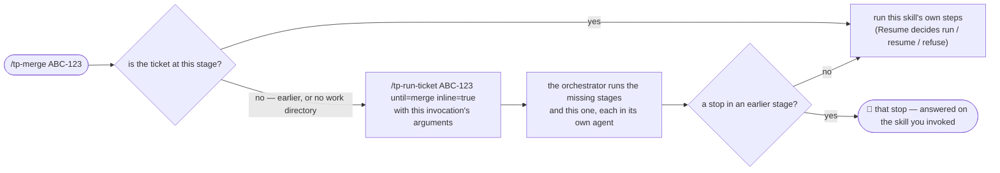
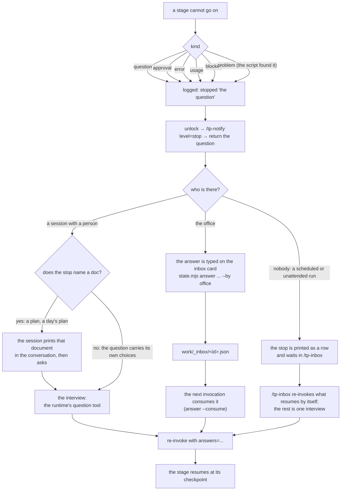
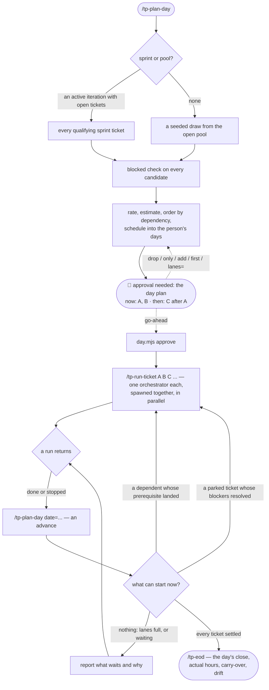
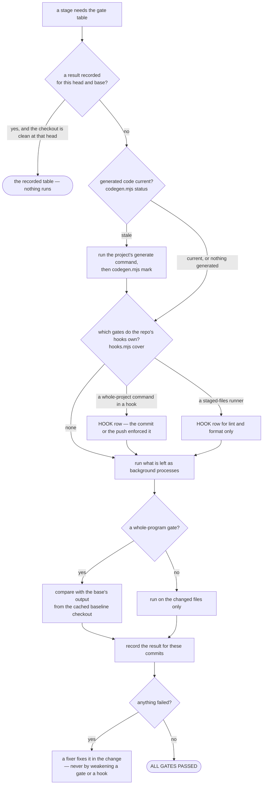
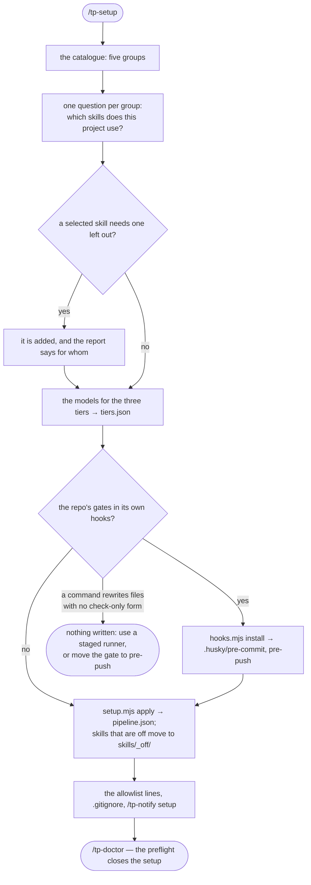
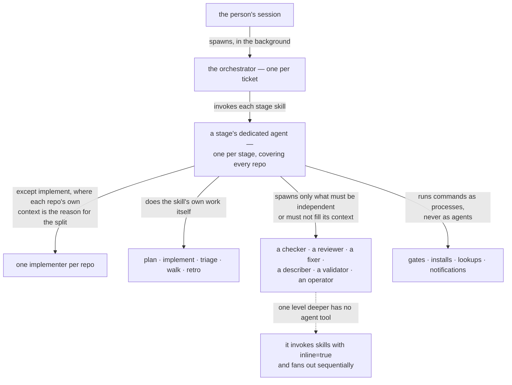

# Flowcharts — every path the pipeline can take

Diagrams for people. Each one is followed by **where each branch lives**, so a box or an
arrow can be traced to the file that decides it: nothing here is a second statement of a
rule, only a map of the rules in `README.md` and the skills.

Agents do not read this file — they read the rules by reference (`README.md`
§ Context management, rule 10). Read it when you want to see the shape of the thing, or
to find which skill owns a decision you are looking at.

Diagram conventions: a **diamond** is a decision the pipeline makes from evidence; a
**rounded box with a bell** (🔔) is a *stop* — it ends the agent and waits for a person
(§ Stops and notifications); a dashed arrow is a path taken only on a person's answer.

## 1. One ticket, end to end

```mermaid
flowchart TD
    START(["/tp-run-ticket ABC-123"]) --> PRE{"preflight fresh?<br/>doctor.mjs fresh"}
    PRE -->|"exit 2 or a failure"| PRESTOP(["🔔 error: the install cannot run<br/>needs: the fix the doctor named"])
    PRE -->|"exit 1"| DOC["/tp-doctor"] --> RESUME0
    PRE -->|"exit 0"| RESUME0{"work directory?"}

    RESUME0 -->|"none"| S1
    RESUME0 -->|"exists"| STATE["state.mjs state --brief"] --> RESUME{"what does the state say?"}
    RESUME -->|"closed or done"| REFUSE(["refuse: round=n+1 or force=true"])
    RESUME -->|"problems"| PROB(["🔔 error: an inconsistency<br/>answers=retry"])
    RESUME -->|"stopped, answer queued"| S1
    RESUME -->|"stopped, usage pause past reset"| S1
    RESUME -->|"stopped, blocked but now unblocked"| S1
    RESUME -->|"stopped, anything else"| STOPOUT(["🔔 the stop, with its resume command"])
    RESUME -->|"in progress or pending"| S1

    S1["1 · /tp-start-ticket<br/>blocked check, assign, rate, estimate,<br/>one worktree + branch per repo"]
    S1 --> S1Q{"pickable?"}
    S1Q -->|"blocked by an open ticket"| S1STOP(["🔔 blocked by ABC-1, ABC-2<br/>nothing to answer"])
    S1Q -->|"soft-blocked, assigned elsewhere,<br/>already done, repo unclear"| S1ASK(["🔔 a question with its answer token"])
    S1ASK -.->|"answers=continue / takeover /<br/>reopen / &lt;repos&gt;"| S1
    S1Q -->|"yes"| S2

    S2["2 · /tp-triage<br/>a fresh agent sizes the change"]
    S2 --> S2Q{"decision"}
    S2Q -->|"close"| CLOSE["close-out: worktrees removed,<br/>ticket commented"] --> DONE
    S2Q -->|"blocked"| PARK["parked: worktrees removed,<br/>blockedBy recorded"] --> PARKSTOP(["🔔 blocked by ... — resumes itself<br/>when /tp-inbox or /tp-plan-day re-checks"])
    S2Q -->|"needs-input"| S2ASK(["🔔 the numbered questions"])
    S2ASK -.->|"answers=1: ... 2: ..."| S2
    S2Q -->|"direct"| S4
    S2Q -->|"plan"| S3

    S3["3 · /tp-plan<br/>this agent plans; a fresh checker verifies"]
    S3 --> S3C{"plan-check verdict"}
    S3C -->|"revise, within the retry bound"| S3
    S3C -->|"revise, bound spent"| S3P
    S3C -->|"ok"| S3P
    S3P{"open questions in the plan?"}
    S3P -->|"yes"| S3Q(["🔔 the open questions"])
    S3Q -.->|"answers"| S3
    S3P -->|"no"| APPROVE(["🔔 approval needed: n steps, risks ...<br/>open risks named"])
    APPROVE -.->|"answers=go-ahead"| S4
    APPROVE -.->|"a change"| S3

    S4["4 · /tp-implement — per repo, in ticket.json order<br/>a commit per step, the hooks gate each commit"]
    S4 --> S4Q{"how did it end?"}
    S4Q -->|"a deviation that changes the approach,<br/>a decision only a person can make"| S4STOP(["🔔 step n — the question"])
    S4STOP -.->|"answers"| S4
    S4Q -->|"a checkpoint failing past its retries"| S4ERR(["🔔 error: step n<br/>answers=retry"])
    S4Q -->|"harder than rated"| S4ESC["re-spawned one tier up<br/>tier=next continue=true"] --> S4
    S4Q -->|"done"| S5

    S5["5 · /tp-create-pr — per repo<br/>commit, sync, gates, push, PR + comments"]
    S5 --> S5Q{"anything a person must decide?"}
    S5Q -->|"a conflict, an unclear intent,<br/>an unexpected diff, a gate that only<br/>passes by changing the approach"| S5STOP(["🔔 the question<br/>ours/theirs, keep/drop/split, change/keep"])
    S5STOP -.->|"answers"| S5
    S5Q -->|"no"| S6

    S6["6 · /tp-merge — per repo"] --> REVIEW["/tp-review in its own agent:<br/>only the PR, the ticket link, a neutral what"]
    REVIEW --> ROUNDS{"model.mjs rounds"}
    ROUNDS -->|"review"| FIX["a fixer applies the items,<br/>/tp-create-pr update=true"] --> REVIEW
    ROUNDS -->|"stop: budget spent or not converging"| LOOPSTOP(["🔔 review loop: why<br/>answers=merge or fix"])
    LOOPSTOP -.->|"fix"| FIX
    LOOPSTOP -.->|"merge"| MERGEOK
    ROUNDS -->|"merge"| MERGEQ{"merge=auto or ask?"}
    MERGEQ -->|"ask"| MERGEASK(["🔔 review PASS — merge, or send fixes?"])
    MERGEASK -.->|"answers=merge"| MERGEOK
    MERGEASK -.->|"answers=fix ..."| FIX
    MERGEQ -->|"auto"| MERGEOK["merge into the base branch<br/>the worktree stays"]
    MERGEOK --> S7

    S7["7 · /tp-release<br/>watch the run, operator follow-ups, smoke"]
    S7 --> S7Q{"how did it go?"}
    S7Q -->|"a failed run, an undocumented<br/>follow-up, a failed smoke check"| S7STOP(["🔔 retry, skip or run"])
    S7STOP -.->|"answers"| S7
    S7Q -->|"promote= given"| PROMOTE["fast-forward the release branch"] --> S8
    S7Q -->|"healthy"| S8

    S8["8 · /tp-accept<br/>every criterion walked, with evidence"]
    S8 --> S8Q{"any criterion failed?"}
    S8Q -->|"yes"| S8STOP(["🔔 n criteria failed — round n+1, or leave?"])
    S8STOP -.->|"answers=round"| ROUND["/tp-run-ticket ABC-123 round=n+1<br/>the same worktree, re-branched from the base"] --> S1
    S8STOP -.->|"answers=leave"| STOPOUT
    S8Q -->|"no"| CLEAN["worktrees removed — the run's last stage"]
    CLEAN --> RETRO{"retro=true?"}
    RETRO -->|"yes"| S8B["8b · /tp-retro — proposals only"] --> DONE
    RETRO -->|"no"| DONE(["done · report.md · /tp-notify level=done"])
```

**Where each branch lives**

| Branch in the diagram | Decided by |
|---|---|
| preflight, and what each exit code means | `README.md` § Using it, Preflight |
| the resume decision (queued answer, usage pause, unblocked, problems, closed) | `README.md` § Definitions, Resume · `tp-run-ticket/SKILL.md` step 0 |
| blocked / soft-blocked at pickup | `tp-start-ticket/instructions/blocked-check.md` |
| triage's five decisions | `tp-triage/instructions/criteria.md` |
| the plan → check → revise loop and its bound | `tp-plan/SKILL.md` step 2 · `tp-plan/instructions/check-criteria.md` |
| the approval, and what an answer other than `go-ahead` does | `tp-plan/SKILL.md` step 3 |
| a step's stop, an escalation, a checkpoint | `tp-implement/SKILL.md` step 2 · `README.md` § Context management, rule 7 |
| conflicts, unexpected diffs, a gate that changes the approach | `tp-create-pr/instructions/sync.md` · `tp-create-pr/instructions/diff-validation.md` |
| the review loop's `review` / `merge` / `stop` | `tp-merge/instructions/review-loop.md` · `README.md` § Review scope and rounds |
| `merge=auto` vs `ask`, and who may merge | `README.md` § Review scope and rounds, Merging |
| the deploy watch, follow-ups, smoke, promotion | `tp-release/SKILL.md` steps 2–5 |
| a failed criterion and the next round | `tp-accept/SKILL.md` step 4 · `README.md` § Worktrees |
| when the worktrees go | `README.md` § Worktrees |
| what a stop does before it returns (unlock, notify, report) | `README.md` § Stops and notifications |

## 2. Entry points — any skill, from anywhere

Every skill works on its own. A stage skill invoked on a ticket that has not reached it
brings the ticket there first, through the same orchestrator, and then runs itself.

| Branch | Decided by |
|---|---|
| what counts as "at this stage" | `README.md` § Definitions, Entry points |
| run vs resume vs refuse | `README.md` § Definitions, Resume |
| which arguments are forwarded to which stage | `tp-run-ticket/SKILL.md` Input |

## 3. A stop, and how it is answered

| Branch | Decided by |
|---|---|
| the kinds, the default, `resumable`, the resume command | `README.md` § Definitions, Asking the user |
| the document a stop names, and showing it before asking | `README.md` § Definitions, Asking the user · `state.mjs` (`docOf`) |
| the order a stop ends an agent in | `README.md` § Stops and notifications |
| queued answers from the office | `README.md` § Definitions, Asking the user · `tp-status/SKILL.md` |
| what resumes without a person | `tp-inbox/SKILL.md` · `tp-start-ticket/instructions/blocked-check.md` § Re-check |

## 4. A day

| Branch | Decided by |
|---|---|
| sprint detection, the pool draw, the feature filter | `tp-plan-day/instructions/selection.md` |
| the proposal and its adjustments | `tp-plan-day/SKILL.md` step 6b |
| how many run at once | `README.md` § Models and budget (`tiers.json.day.lanes`) |
| when a dependent may start | `README.md` § Worktrees (stacked) · `day.mjs` header |
| the blocker re-check and its freshness | `tp-start-ticket/instructions/blocked-check.md` § Re-check, § Freshness |
| the day's close and the estimates' drift | `tp-eod/SKILL.md` · `README.md` § Models and budget, Estimates |

## 5. A gate — who runs it, and who does not

| Branch | Decided by |
|---|---|
| the whole rule: reuse, hooks, then run | `README.md` § Verification rules |
| what a hook covers, and at what scope | `hooks.mjs` header · `tp-verify/SKILL.md` step 0b |
| generated code and staleness | `README.md` § Toolchain · `codegen.mjs` header |
| the baseline and the per-commit record | `tp-verify/SKILL.md` step 2 · `gates.mjs` header |
| a failing gate, and what is never done about it | `README.md` § Verification rules · § Commits |

## 6. Installing it in a project

| Branch | Decided by |
|---|---|
| the catalogue, the groups, the dependencies | `skills/_lib/setup.mjs` (`GROUPS`) · `tp-setup/SKILL.md` |
| what an off skill changes downstream | `README.md` § Definitions, Active skills |
| the hooks, and when they are refused | `README.md` § Verification rules · `hooks.mjs` header |
| what the allowlist must cover | `README.md` § Using it, Install |

## 7. Who runs in which agent

| Branch | Decided by |
|---|---|
| the dedicated-agent rule and what a skill does itself | `README.md` § Definitions, Dedicated agent |
| when a second agent is justified | `README.md` § Context management, rules 2 and 9 |
| one agent per stage, and why implement is the exception | `README.md` § Context management, rule 9 · `tp-create-pr/SKILL.md` · `tp-merge/SKILL.md` · `tp-release/SKILL.md` |
| commands batched into one call rather than a turn each | `README.md` § Context management, rule 12 |
| commands and lookups without an agent | `README.md` § Context management, rules 4 and 11 |
| the depth limit | `README.md` § Definitions, Depth |
| which model each agent runs on | `README.md` § Models and budget |
